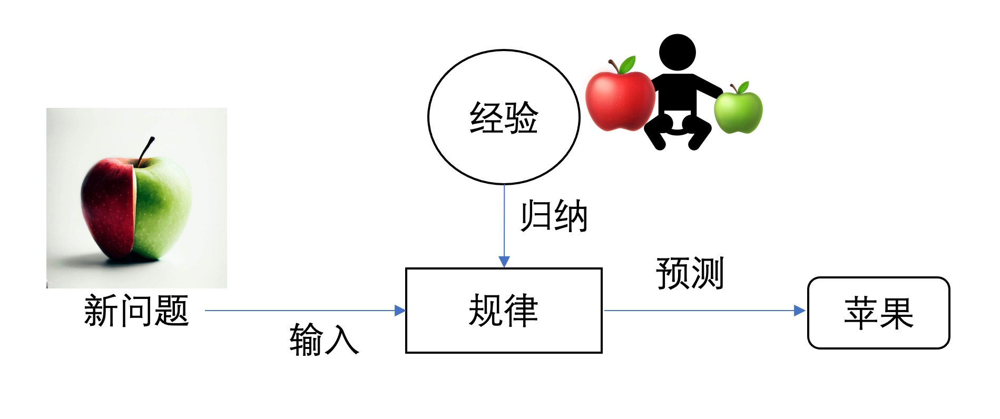
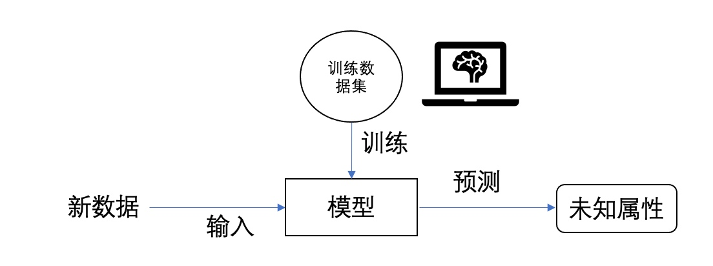

# 1  AI系统概述
## 1.1 AI的简介
AI这个缩写在越来越多的出现在公众面前，但是AI到底是什么就和AI这个词一样，大部分都能举一些例子，但是都却很难说清楚AI到底是什么。AI是Artificial Intelligence的简称，中文叫做人工智能。但是要找到一个完全被所有人都公认的AI的解释是很难的，目前认可度最高的两个AI的定义分别是美国斯坦福大学人工智能研究中心尼尔逊教授给AI下的定义：“AI是关于知识的学科——怎样表示知识以及怎样获得知识并使用知识的科学。”而另一个美国麻省理工学院的温斯顿教授认为：“AI就是研究如何使计算机去做过去只有人才能做的智能工作。”其实要给一个研究领域给一个确切、完整的概念一点也不容易，尤其是类似AI这种在多种基础学科基础之上快速发展的理论、方法、技术以及应用的一个新技术。当前AI已经影响了我们生活的方方面面，适应性非常强和影响性非常强，逐渐的发展成了一个多元跨专业的技术。
1956年夏，麦卡锡、明斯基等科学家在美国达特茅斯学院开会研讨“如何用机器模拟人的智能”，首次提出“人工智能（Artificial Intelligence，简称AI）”这一概念，标志着人工智能学科的诞生。但是真的要追溯AI的起源，那么可以追溯到1936年阿兰·图灵发表的《论可计算数及其在判定问题中的应用》，文中给出了“一个拥有铅笔、纸和一串明确指令的人类计算着，可以被看作是一种图灵机“，这也是为了可计算数的解释而引入的一种举例，这样就定义了一个在功能上等价的数学运输的人。这也是最早的一些智能和计算机相关的内容了，从那时开始”图灵机“就开始影响了“智能”定义和评价。到1950年克劳德·香农提出了计算机的博弈，随后1954年“图灵测试”的提出，艾伦·麦席森·图灵给人类代入了让机器拥有智能的狂想和探索。虽然AI的概念随后就没提出来了，但是直到20世纪60年代，符号逻辑的提出才解决了很多AI上通用问题，为人类自然语言和机器语言的对话奠定了基础，这也使得一些人际会话、专家系统、模式识别等方向，同时期人们也开始更加冷静的看到人工智能，人工智能的发展进入了一个缓慢的时期。
直到1976年，兰德尔·戴维斯构建了大规模知识库以及后续机器人系统的出现开始将AI推入了又一次的浪潮之巅，这个时候的知识表示、启发式搜索、大规模知识库、计算机视觉、专家系统、贝叶斯网络以及基于行为的机器人等开始有大面的演进进展和优秀的学术成果的诞生。
20世纪90年代有两大重要的发展节点，一个是语义网络的提出为2012年谷歌推出知识图谱的概念奠定了基础；另外一个是支持向量机、条件随机场以及话题模型LDA等的统计机器学理论的发展，都为未来AI的发展起到了推动作用。
2006年以后到现在，AI进入了大爆发时期，机器人、迁移学习、联邦学习、自动驾驶、知识图谱、卷积、生成对抗网络GAN、深度学习等都有了快速的发展，很多优秀的公司涌现出了很多优秀的开源项目或者闭源项目。
## 1.2 AI系统的分类
AI系统有着各式各样分类方法，其中既有我们熟悉的分发也有我们不熟悉的分类方式，但是每种分法都是对AI系统不同角度的一种描述的聚类方式。目前比较主流的划分方法主要有按AI的研究内容分类、按AI的实力和水平分类、按照信息来源或形式的种类分类以及根据模型的参数量或复杂度分类等等。
- 按AI的研究内容：
    - 自然语言处理是指让计算机理解和生成自然语言（如汉语、英语）并进行交互或沟通的技术。自然语言处理包括自然语言理解（NLU）、自然语言生成（NLG）、对话系统（DS）等多个子领域，以及文本分类、文本摘要、文本翻译、问答系统等多个任务。
    - 计算机视觉是指让计算机从数字图像或视频中获取有意义信息，并基于这些信息采取行动或做出反馈的技术。计算机视觉包括图像处理、图像分析、图像理解等多个子领域，以及目标检测、目标跟踪、场景理解、表情识别等多个任务。
    - 机器人是指由电子设备组成并具有一定形态与功能，并且可以接收外界信息并对其做出反应与控制，并完成各种复杂动作与任务的装置。
    - 机器学习是指让机器从数据中自动学习规律和知识，并利用这些规律和知识进行预测或决策的技术，机器学习包括监督学习、无监督学习、强化学习，其中监督学习也被称作有监督的学习，有监督的意思就是预先知道据有什么样的目标，通过一些已经知道结果的数据（也叫做有标注的数据）训练模型，完成训练后，再将新问题给模型去解答，常用的有监督的算法有KNN（K近邻）算法、线性回归、罗辑回归、支持向量机、决策树、神经网络等；无监督学习就是用没有标注的数据进行模型训练，从没有标注的数据中找隐藏的特征，这其中无需人工干预，该类算法可以发现信息的相似性和差异性，一些比较重要无监督学习算法包含了k-means算法、分层聚类算法、最大期望算法（EM）等的聚类算法，主成分分析（PCA）、核主成分分析、局部线性嵌入等降纬算法以及先验算法（Apriori）频繁项集挖掘（Eclat）等关联规则学习算法；强化学习是就是再联系的学习交互中不断的学习更优的方法，从而制定最佳的策略，其中包含了策略优化、Q-learning等。

- 按照AI的实力和水平分类：
    - 弱人工智能也叫狭义人工智能，是指只擅长某个单方面应用或特定任务的人工智能，超出特定领域外则无有效解。目前我们周围的大部分 AI 都属于这一类，如语音识别、图像识别、推荐系统等。
    - 强人工智能也叫通用人工智能，是指在各方面都能和人类比肩甚至超越的人类级别的人工智能，在理解、推理、创造等方面都具有自我意识和自主学习的能力。这种 AI 目前还没有实现，只存在于理论和科幻中。
    - 超人工智能也叫超级智能，是指在各个领域均可以远远超越人类的最高级别的 AI，在创新创造、创意创作等方面都可以产生出任何人类无法想象或解决的问题或作品。这种 AI 也还没有实现，甚至可能永远无法实现。

- 按照信息来源或形式的种类分类：
    - 单模态是指只有一种信息来源或形式的情况，比如只有视觉或只有语言。
    - 多模态是指有多种信息来源或形式的情况，比如视觉、听觉、触觉、嗅觉、语言等。多模态可以利用不同模态之间的互补性和关联性，提高信息的完整性和准确性。多模态通过模态转换、对齐、融合等可以实现更丰富和复杂的任务，从而实现更接近人类的认知和交互方式，实现自然和智能的人机交互。
- 根据模型的参数量或复杂度分类：
    - 大模型通常指参数量超过百亿或千亿的模型，如GPT-3、盘古、Switch Transformer等，它们需要大量的数据和计算资源来训练，但可以实现更强的泛化能力和自监督学习能力，被称为基础模型或基石模型。大模型的优点是可以实现更强的泛化能力和自监督学习能力，可以利用海量的数据和知识，可以实现更丰富和复杂的任务，可以更接近人类的认知和交互方式。大模型的缺点是需要大量的数据和计算资源来训练，可能存在信息冗余或过拟合的问题，难以解释和理解，可能带来伦理和社会的风险。
    - 中模型通常指参数量在千万到十亿之间的模型，如BERT、ResNet、Transformer等，它们是目前应用最广泛的模型，可以在各种领域和任务中取得较好的效果，但也面临着数据标注、模态转换、对齐融合等挑战。
    - 小模型通常指参数量在千万以下的模型，如LeNet、AlexNet、LSTM等，它们是深度学习的基础和起点，相对简单和高效，但也存在信息缺失或不确定性的问题，难以实现复杂和丰富的任务。

AI的分类不仅仅只包含了如上这几种划分方法，上面几种分类方式是比较适合测试工程师角度观察AI系统而实用的分类方法。除此之外还有按照知识板块划分成搜索、逻辑与推理、学习、规划与学习、执行；按照和人的关系可以分为人机交互类和自主决策类；按照学习方式可以分成自我学习、样例学习、强化学习等。无论哪一种分类方式都是站在不同角度观察AI后得到的结果，因此哪一种都是合理的。

## 1.3 机器学习的模型和分类

自从AI被证实提出后，人工智能就开始逐渐走进人们的视野，当时对人工智能的理解还很肤浅，随着很多科幻电影和小说不断的对人工智能的描述，才使得人们逐渐认识到了人工智能的应用未来会是一个什么样的场景。在1980年以后，人工智能领域逐渐的发展出了机器学习，它是人工智能的核心，它专门研究计算机怎样模拟或实现人类的学习行为，以获取新的知识或技能，重新组织已有的知识结构使之不断改善自身的性能。机器学习从名字上我们就可以看出这是研究让机器可以自我学习的算法，从数据中分析获得规律，利用规律对于新数据进行一些预测。这个过程和结果和人类的学习很相似，但是获取知识、知识强化以及知识运用的过程还是有很多不一样的地方，人类的学习是新知识的学习或者是对已经掌握的知识的、行为、技能等的加强，而机器学习是通过算法、大数据的分析等通过输入、输出的转换完成机器的某一种逻辑的处理，这和人类的学习确实难以相提并论的。人类的学习通过不同的知识学习积累自己的经验，在此经验之上会总结规律，这个规律就会变成一个认知新事物的方法。

假设一个妈妈给自己的孩子一个大的红苹果，那么孩子会学习这种外形、颜色、味道等等的就苹果，那么第二天妈妈在给孩子一个小的绿苹果，孩子会在昨天学习的评估的经验之上再丰富了对苹果的认知经验，然后总结出来一个对苹果的认识规律，那么当再次遇见一个大的半红半绿的苹果的时候，他会预先判定这就是一个苹果。

那么机器学习其实是通过大量训练数据集的训练，得到一个模型，这个模型可以识别不同的对应的判断逻辑，当有新的数据进入模型后，他会按照模型给出判断结果，这和人的的学习过程有些类似，但是人类是通过各种经验的归纳做得到的规律，而机器学习是通过大量的数据得到的模型，两者是不一致的方式，所以人可以完成新问题的预测，机器学习并不一定能给出新数据正确的结果。虽然机器学习还无法和人类学习相提并论，但是机器在一些大范围、大数量的信息处理上，在计算速度上确实比人类的表现的更加优秀，因此机器学习还是需要投入更多进行更加深入的研究的。

机器学习也是有各式各样的分类方式，每一种都是站在某一个角度对机器学习进行的划分。
- 按照学习方式分：
    - 监督学习：有监督学习就是需要准备好输入与正确输出的训练数据集，也就是说训练数据集是打标数据，用这样的数据训练模型，从而可以使得得到的结果是预期的结果。有监督学习需要有大量的训练数据，不仅仅是输入，还需要区分方法，也就是需要正确的数据标签。训练集数据是打标的，也就是输入和输出是成对出现的，测试集数据也是成对出现的。现在来说比较重要的监督学习算法有KNN（K最近邻算法）、线性回归、逻辑回归、支持向量机、决策树和随机森林、神经网络等。
    - 无监督学习：无监督的学习就是让计算机自我学习，通过一些有特征但是无标注的数据集进训练，从而得到一个模型，这个模型可以实现对数据的一些聚类、降维、可视化等方向。无监督算法包含K-Means聚类算法、分层聚类算法、最大期望算法（EM）等聚类算法，主成分分析（PCA）、核主成分分析、局部线性嵌入、t-分布随机进临嵌入等可视化与降纬算法，Apriori、Eclat等关联规则学习算法。
    - 强化学习：主要是以目标为导向的一种从感知到决策的问题解决思路。通过“惩罚”和“奖励”的方式训练模型在各种环境中采取的不同行动，以最大限度的积累奖励为目标。强化学习的核心思想是通过不断试错，最后找到最大化的预期利益。强化学习主要由智能体、环境、状态、动作、奖励、策略等组成元素构成。强化学习的本质是学习最优的序贯决策。
- 按模型分类：
    - 概率和非概率模型：概率模型和非概率模型的划分主要是按照模型的内在结构划分的，概率模型一定可以表示为联合概率分布的形式，而非概率模型就不一定。概率模型比较典型的有决策树、朴素贝叶斯、隐马尔可夫、条件随机场、概率潜在语义分析、潜在狄利克雷分配、高丝混合模型、逻辑斯蒂回归等；非概率模型比较典型的有感知机、支持向量机、KNN、AdaBoost、K-Measns、潜在语义分析、神经网络等。
    - 线性和非线性模型：按照概率函数是否是线性的，可以分为线性模型和非线性模型，那么典型的线性模型包含感知机、线性支持SVM、KNN、K-Means、潜在语义分析；典型非线形模型包含核函数SVM、AdaBoost、神经网络等。
    - 参数化和非参数化模型：参数化模型是设定是参数纬度固定的模型；非参数化模型是参数纬度不固定也可以不穷大的模型，伴随着训练数据的增加而不断增大。参数化模型包含了感知机、朴素贝叶斯、逻辑斯蒂回归、K-Means、高斯混合模型等；非参数化模型包含决策树、SVM、AdaBoost、KNN等。
- 按照训练样本数量分类：
    - 大样本学习（Large-scale learning）：是指需要大量（如数百万或数十亿）训练样本的机器学习问题。这类问题通常需要使用分布式计算、并行化、降维等技术来提高效率和准确性。例如，深度神经网络、推荐系统、自然语言处理等领域都涉及到大样本学习 。
    - 中等样本学习（Medium-scale learning）：是指需要中等数量（如数千或数万）训练样本的机器学习问题。这类问题通常可以使用传统的监督或无监督的机器学习算法来解决，如支持向量机、决策树、聚类等。
    - 小样本学习（Few-shot learning）：是指只有少量（如数十个）训练样本的机器学习问题。这类问题通常需要使用元学习或迁移学习等技术来提高模型泛化能力，并利用支持集和查询集等概念来进行训练和测试 。
    - 单样本学习（One-shot learning）：是指只有一个训练样本的机器学习问题。这类问题通常需要使用相似性函数或度量学习来比较数据之间的差异，并根据阈值进行判断 。
    - 零样本学习（Zero-shot learning）：是指在测试时从训练中没有观察到的类中观察样本，并预测他们所属的类。它通常需要借助一些辅助信息，如属性或文本，来建立可见类和未见类之间的联系，并实现跨模态知识的迁移 。
    
## 1.4 AIGC是新趋势
AIGC，AI-Generated Content是基于AI的内容生产，这是AI技术的一个应用方向，AIGC分开看，后两个字母GC代表了内容生成。内容生产包含了UGC、PGC、AIGC，其中：

- UGC：User-Generated Content，就是用户生产的内容，其实就是互联网普通用户创作的内容，包含照片、视频、文字等内容，UGC主要体现了普通用户的创作能力和个性化的内容产出需求。UGC有一些比较显著的特点，就是形式多样、质量良莠不齐、来源广泛、传播快速等特点。
- PGC：Professionally-Generated Content，专业内容生成。这里主要强调是专业，那么内容的生产者是专业的机构或者专家，是具备内容相关方面的专业背景知识，具备专业的内容生产能力，可以保证内容的专业性和质量的。PGC很注重内容的原创和版权。PGC也有内容形式多样性的特点，但是他的内容质量高，内容使用的成本也较高，这种内容可溯源、有传播力。
- AIGC：AI-Generated Content是利用AI技术生成的内容，如利用自然语言处理、图像识别、深度学习等技术生成的文本、图像、音频等。AIGC的主体发生了变化，主要是从自然人的内容生产主体变成了人工智能，利用数据、算法生成内容，而不是人为主体的创作。因为是AI的生成，所以具备创造专业

Gartner发布的2022年5大影响力技术之一就是AIGC，可见AIGC已经有了更多方面的应用和发展，当前的AIGC已经不仅仅约束与生成文本、图像、音频等内容，也在科学新发现、新领域探索等方面有了一些优越性的表现。

AIGC的现状也有一些基础技术的发展引起的从量变到质变的过程，算法模型的不断发展和突破，为AIGC提供了快速发展的基石；预训练模型的出现让AIGC的技术表现有了更深一步的提高，尤其是自然语言处理预训练模型、机器视觉处理预训练模型、多模态预训练模型等，提供了高效率、高品质的各类内容的生产基础。
但是AIGC也会面临很多挑战，AI模型的训练需要大量的数据，这些会引起数据的安全性和隐私保护的问题，AIGC就需要考虑如何优化算法，以避免一些伦理道德的红线不会触碰。“2022年3月16日，美国版权局（USCO）发布的美国法规第202部分，AI自动生成的作品，不受版权法保护。”这也变相说明了无法确认AIGC的内容是没有办法证明没有触碰版权法的约束的。同时AIGC的内容应该也要符合人类的价值观和道德观的，一些偏见、歧视或误导的信息是不应该被生产出来的。AIGC还可能会影响人类的社会关系和文化多样性，因为AIGC生成的内容可能会削弱人与人之间的交流和互动，或者破坏不同文化和群体之间的尊重和理解。所以技术是好技术，对于技术的应用是否是安全的、是否是道德的就需要人来约束和验证，因此AIGC的一些应用的测试乃至AI系统的测试工作都为测试工程师提出了一个新的挑战。

## 1.5 AI系统对测试工程师提出的新问题
目前AI系统主要是对AI应用最为广泛的四个领域是自然语言处理、图像识别、推荐系统、机器学习这四个方面。每个AI系统都包含了一个及其以上的AI模型，那么支撑AI模型对外提供服务还需要很多传统组件，例如数据库、Web容器、交互界面等等。所以非AI系统可能出现的缺陷，在AI系统中都有可能存在，因此我们常规的测试方法、技术、实践还都是适用的。除此之外AI系统与非AI系统相比还有一些其特殊性，所以专门针对AI系统的测试策略、方法和实践也是需要深入研究和探讨的。
### 1.5.1 测试彻底变成了黑盒
我们都知道非AI系统的测试过程中，每一个测试用例都有一个明确的测试预期，但在AI系统的测试过程中，对于每一个测试用例往往难给定一个确定的测试预期，这就使得预期变成了不确定性的，“测不准”的问题突显。那么测试工程师如果不能完全从业务角度理解AI系统的目标，也就很难确定在执行测试过程中的实际结果是否满足业务目标，这么说了AI系统的测试工程师一上来就要是一个业务专家，实现最终态的测试左移。

AI系统中的AI部分是以完成目标的驱动方式建设的，这就和我们非AI系统的功能实现为目的的建设方式不一样，很多AI系统是如何实现目标的往往没有办法完全展示给测试工程师（例如用了神经网络的某种算法实现了一个目标，测试工程师却无法搞清楚这个算法是如何运行并得到目标结果的），还有一些自主规划、自主决策设备（例如机器人、无人机等）在测试过程中也是很难理清楚是什么逻辑导致了这个自主结果。

### 1.5.2 数据划分困难
AI系统测试过程中需要的数据不仅包含我们非AI系统常说的测试用例的输入数据，更重要的一部分是AI算法训练模型需要的“原始数据”。常规将这部分原始数据设计为训练集、验证集、测试集。
- 训练集是用来训练模型使用的。
- 验证集是模型在新数据（验证集和测试集是不同的数据）上的表现如何。（验证集不是必须存在的，如果不需要调整超参数，就可以不使用验证集，直接用测试集来评估效果就可以了，同时验证集评估出来的效果并非模型的最终效果，它主要是用来调整超参数，最终效果还是需要测试集评估的）。
- 测试集是独立于训练集和验证集之外，通过测试集来做最终的评估。

在AI系统的研发生命周期中，数据集的设计如果有一定的偏差，会导致最后的结果会相差甚远，但是这也并不能确定AI系统没有实现原始业务目标。那么如何选择原始数据，又如何划分数据集对测试工程师就提出了新的挑战。

### 1.5.3 从学习到智能让测试预期变得模糊

AI能系统在实现目标的过程中都是黑盒的，而且目标实现效果有可能会随着系统的自主学习发生改变，通过学习系统自身过去的经验来进步目标实现效果。在这样的情况下一些原来有效的测试预期就有可能不再有效。那么测试工程师应该在什么时间节点给出原测试预期已经不再有效，新的系统实际反馈是正确的结果的判断。
除此之外，如何测试一个AI系统是否有自主性是更进一步需要解决的问题。测试自主性就是要想办法让其脱离自主行为，并让其在一种未能确定的情况下进行人工主动的干预测试。说白了就是想办法去“愚弄”AI系统，让AI系统以为自己在自主行为下进行目标的达成。这种情况说出来容易，如何诱导AI系统脱离自主行为却并没有一个通用的方式方法，对应的测试预期也难以确定。面对这些难以回答的问题，只能通过与业务专家的讨论将模糊的测试预期变得明确。

自主学习、硬件环境变化、数据集的变更都会导致系统的进化，因此对于AI系统的测试并不能和非AI系统的测试一样，在系统交付上线后就不再关注了（除非又发生变更）。测试工程师需要长期的、有固定周期的进行的测试，不断的获取监控指标，持续的评价系统原始目标的达成情况，在评价过程中这种进化的准确性、精确性、敏感性都是需要被考察的。无论AI系统的进化是如何发展的，最后都是受众可理解的，最好要求目标受众（或一组有代表性的测试者）参与进行测试，以确定他们对目标的实现是理解的。

### 1.5.4 偏见要识别原因
AI系统的偏见是很常见的问题，最为常见的就是训练集中有偏见，这种其实需要数据专家帮忙审核，将导致偏见的数据识别并删除。测试过程中要使用无偏见的测试集进行独立的测试，这样才能发现训练集中是否有偏见的。
当我们发现有偏见数据的时候，我们可以通过去掉一些偏见数据来避免这种情况出现，有时候偏见数据还会触及一些法律风险，例如数据中有隐私数据，就有可能通过模型得到某些个人隐私的反馈，这样的反馈是不合法的，因此我们需要在数据中就去除这一类数据。

### 1.5.5 可能性导致了需要重定判断标准

很多AI系统的实现都是基于概率的，因此每次的返回预期都不是完全一致的。例如自动驾驶的路线规划，由于红绿灯、拥堵情况等的影响，每次会基于时间优先的策略规划路线，这有可能不是一个距离上的最优解，但是肯定是一个距离和时间上的有效解。这种方式我们就应该设计一种置信区间，通过区间内外来确定结果的可信程度。其次，测试过程还需要多次的运行，从而评价正常的结果概率。

## 1.6 总结

1936年阿兰·图灵发表的《论可计算数及其在判定问题中的应用》开启了人工智能的篇章，从1950以后，AI这个词的诞生，也注定了人工智能将会不断的影响人类的生活，那么这么多年的发展和积累，AI已经开始影响了我们生活的方方面面，尤其是二十一世纪二十年代以来，AI已经开始影响到了几乎世界上的每一个人。AI的快速发展也为测试工作提出了新的挑战，这些挑战无疑也为系统测试工作提供了新的探索和研究的方向，那么下面的章节我们就会针对AI系统的测试做深入的阐述。

