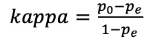
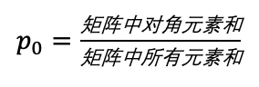
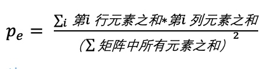
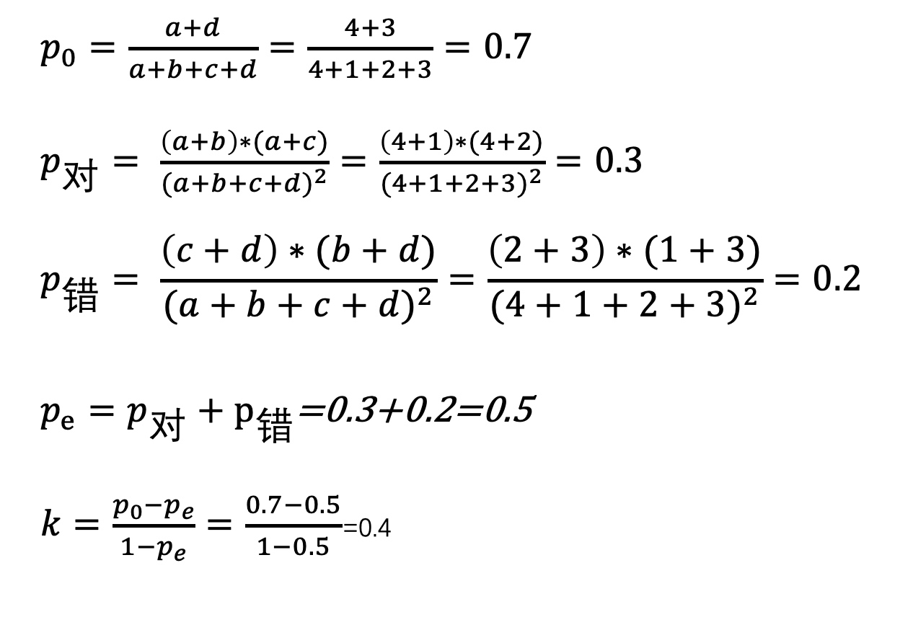
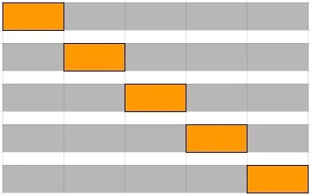
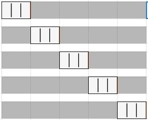
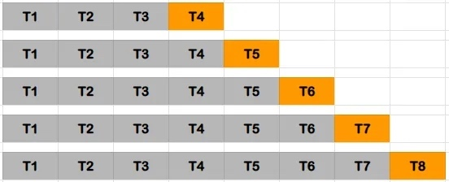
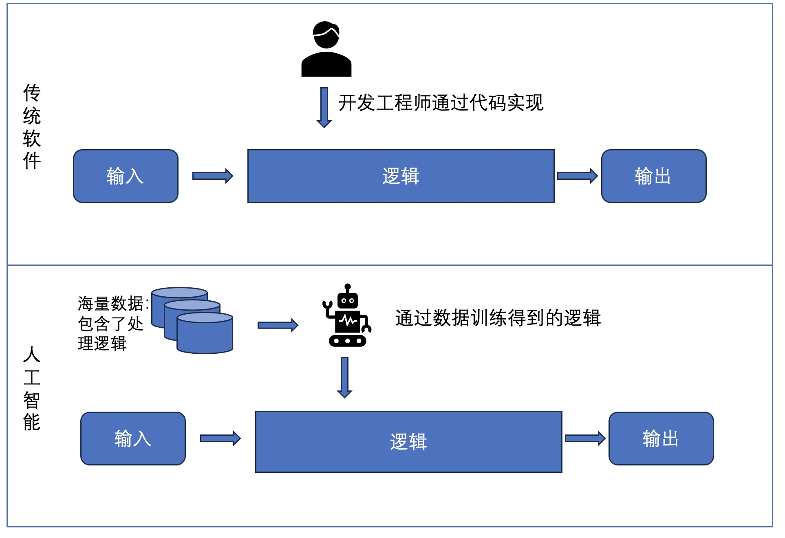

# 2 数据和测试评价

## 2.1 数据收集和清洗

为了训练AI模型，需要收集和准备足够的数据。数据应该涵盖各种情况和场景，以确保系统在各种情况下都能准确地运行。数据原始来源应该是真实的，并且应该涵盖系统预计的使用情况。数据应该根据特定的需求进行采样和处理，可以来自各种来源，例如公共数据集、第三方数据提供商、内部数据集和模拟数据集等。很多大模型训练的数据从广义上可以分成两大类，其一是通用文本数据，包含了网页、书籍、网络留言以及网络对话，这类主要是因为获取容易、数据规模大而被广泛的大模型利用，通用文本数据更容易提高大模型的泛化能力；其二是专用文本数据，主要是一些多语言类别的数据、科学相关的产出数据以及代码，这类数据可以提高大模型的专项任务的能力。在准备数据时，还应该注意数据的质量，例如数据的准确性、完整性和一致性。另外，还应该考虑隐私和安全问题，如果数据包含敏感信息，例如用户的个人身份信息，应该采取脱敏措施确保数据的安全性和隐私性。数据收集和准备是测试AI系统的重要步骤之一，需要充分的计划和准备，以确保测试的准确性和全面性。

数据收集完成后，通常是要对数据进行清洗，这里的清洗说的是对数据一些“不好”的内容的处理，这里的不好指的是数据的噪音、冗余、有毒等内容，从而确保数据集的质量和一致性。


无论收集到的数据集是通用文本数据、还是专用文本数据都要经过一系列的数据清洗才能用于 LLM 模型的训练，在面对初始收集的数据集需要首先通过质量过滤提高数据集的数据质量，常规的做法是设计一组过滤规则，消除低质量的数据，从而实现数据质量的提高。那么常用的规则有基于语言的过滤规则、基于度量的过滤规则、基于关键词的过滤规则。
- 基于语言的过滤规则：如果LLM主要用于某一类语言的任务处理，那么就可以建立清除其他语言的数据的过滤规则，从而剩下目标语言的数据。
- 基于度量的过滤规则：可以利用生成文本的评估度量，也就是 LLM 生成的问题进行度量从而检测并删除一些不自然的数据。
- 基于统计的过滤规则：利用数据集中统计特征来评价数据集中的数据的质量过滤低质量的数据，这里的统计特征可以是标点的分布、符号与单词比率，句子长度等。
- 基于关键词的过滤规则：基于特定的关键词集合，可以识别和删除文本中的噪音或无用元素，例如 HTML 标签、有毒词语等。

在数据清洗中一个重要的工作就是去重和补缺，在收集到的数据集中可能有很多重复的样本，那么在数据集可以投入使用之前通过对数据各个字段的检测删除重复内容，确保数据集中的样本都是唯一的。在去重的过程中，我们同样也会关注数据是否有缺失，这里的缺失是指某些字段或者特征缺少信息，而不是说少了某一方面的数据，对于缺失值的数据我们可以选择删除该条记录，也可以使用插补方法填充缺失内容。目前常用的插补方法有均值填补、中位数填补、众数填补以及用其他一些模型进行预测填补，均值填补就是使用数据集中缺失字段其他记录中其他数据的算术平均数进行填补（算术平均数是一组数据之和，除以这组数据个数的结果值）；中位数填补和均值填补的思路类似（中位数是按顺序排列的一组数据中居于中间位置的数），就是填补进去的值不再是算数平均数而是对应缺失字段的中位数；众数填补（众数是在一组数据中,出现次数最多的数据。）也是同样的道理，就是用众数替换了上面的算术平均数。用模型进行预测填补是一个目前还说相对较新的方向，利用一些模型的预判能力补充数据的缺失。无论是哪一种，都会面临一些填补后数据出现重复样本的可能，因此去重和数据缺失填补是一个交替的工作。
由于数据集的来源不唯一，因此数据除去重复、缺失值意外还有可能很多不一致的问题，这些问题有些是因为原系统的数据是人工输入的、也有可能是不通系统的设计差异导致的，例如在日期的存储中，不同的系统设计差异性非常大，有的采用了日、月、年的方式存储，有的是月、日、年的顺序存储，有的采用了/作为分割线（20/02/2022，是 2022 年的 02 月 20 日），有的采用-作为分割线（02-20-2022，是 2022 年的 02 月 20 日），因此需要将其含义一样，但是表现不一致的数据统一格式，将文本数据转换为小写或大写形式，统一单位等。在处理数据一致性的过程中同时也会关注数据的异常值，这里说的异常值不是数据缺失，而是数据有明显的问题，数据很多原始来源都是人工输入的，往往很多原始系统的设计就会导致数据出现问题。异常值可能是由于测量错误、数据录入错误或真实且重要的异常情况引起的，例如我们在人口统计的数据中，年龄的字段看到了 300 ，那么这个数据就明显违反了常规逻辑，因此我们可以选择删除异常记录，或者按照前面缺失值填补方法中的均值填补、中位数填补、众数填补等方法进行填补。

隐私去除也是必不可少的数据清洗的流程，用于训练大模型的数据绝大部分都是来自网络的，这里面包含了大量的敏感信息和个人隐私信息，如果这样的数据用于大模型的训练那么对于大模型的伦理道德的会形成潜在的风险，增加隐私泄露的可能性。因此，必须从数据集中删除这方面的内容。在隐私去除过程中我们比较常用的就是基于规则的方法，例如建立删除规则的关键字，通过关键字规则删除姓名、电话、地址、银行账号等等的隐私数据。

在完成如上的数据逻辑方面的清洗后，就要进行数据可用方面的清洗，将数据类型进行正确的转换，确保数据的类型与任务的要求相匹配。例如，将文本字段转换为分类变量、将数字字段转换为连续变量或离散变量。在完成转换后，要对数据进行验证，验证数据的格式、结构是否满足了预期，例如日期字段是不是要求的格式、数据精度是否符合模型需求等等。对于跨多个数据表、数据源的数据集，对齐数据之间的关联性也需要进行分析，提出由于数据来源的不通而引起的数据偏差和错误。如果数据集过大，可以采用随机或其他采样方法来减少数据量，以加快处理和分析的速度。但要注意，采样可能会引入采样偏差，因此需要权衡和考虑采样策略。如上全部的清洗过程，都需要记录、留痕，也为了能够在后续的模型训练过程中出现一些非预期的结果的时候，反向追溯可以浮现数据清洗过程，帮助查找问题。


## 2.2 数据标注

对于监督学习任务，数据标注是必不可少的。这涉及将输入数据与所需的输出结果相关联。数据标注可以是手动完成的，也可以利用自动化工具或众包平台来加速过程。手工标注是最为常见的标注方式，人工通过分类、画框、注释、标记等动作完成不通数据类型的数据标注工作，标注的数据往往数据量大，仅仅靠一个小团队很难完成这类任务，因此通过平台众包的方式的众包标注就变成了一个行之有效的解决问题的办法，需要标注数据的雇佣者通过众包平台来聘请很多的人参与数据标注，从而快速完成标注，并且可以通过对人标注相同数据从而获得多个标注结果，来提供最终标注结果的准确性。但是人工标注有很多弊端，例如人工标注效率低下，同时有可能导致不同人对标注的理解不一致导致标注的精确，还有就是人工标注的准确性完全仰仗人工标注工作人员的个人素养，如果标注者做事认证、负责那么标注的结果就更加精确，否则标注的结果也不会出现偏差。那么自动化的标注在很大程度上就可以避免很多由于人的个人意识而导致的标注失败，通过一些标注算法或者模型完成自动标注工作，例如使用预训练的图像分割模型来自动完成标注图像中的像素级别的标签等，从而可以变相的节省人工成本，减少人员投入，同时也可以提高人工标注的偏差。但是这种纯自动的标注目前来说可以完成工作有限，并不是任何一种数据都适合自动化标注算法的，自动化的标注的适用范围还是很有限的。那么大量的标注任务都通过人工标注完成就变成了一件又贵又慢的事情，所以半监督学习的标注方法就逐渐的展现出来了优越性，在有标注数据的基础上，结合为标注数据和模型的预测结果，可以高效的完成标注工作。
无论是哪一种标注，我们都需要对数据标注的质量进行控制，通过对参与标注的人员的培训，为其提供清晰的标注指南和标准，以及对标注结果进行审查和验证。如果有多个标注折参与标注工作，那么还需要保证标注的一致性，以免由于标注问题引起后续模型的偏差，现在比较常用的衡量标注是否一致的指标是Cohen's Kappa系数，Cohen’s kappa系数常用来检查一致性，是一致性验证的指标,在标注中是否一致，就是说标注数据和实际分类是否一致.Cohen's kappa 系数的计算是基于混淆矩阵的，取值在-1到1之间，通常是大于0的。计算公式如下：


其中:
- 标注一致性：

- 随机一致性：


举个例子，有标注员小红和小丽，他们分别对 20 条数据进行了对和错的分类标注，计算的混淆矩阵（混淆矩阵也称误差矩阵，是表示精度评价的一种标准格式，用n行n列的矩阵形式来表示。）如下所示。
|0| 1| 2| 3|
|-----|-----|-----|-----|
|1|   | 对 | 错 | 
|2| 对 | a   | b   | 
|3| 错 |  c | d  | 

如上表所示，行是小红的标注，列是小丽的标注，表格中第一行第一列是表示小红标注的是“对”，小丽标注的也是“对”的数据个数；表格中第一行第一列是表示小红标注的是“对”，以此类推。将对应数据填入表格如下：

|0| 1| 2| 3|
|-----|-----|-----|-----|
|1|   | 对 | 错 | 
|2| 对 | 4   | 1   | 
|3| 错 |  2 | 3  | 

那么，我们利用Cohen's kappa计算如下：


如上的计算过程可以用如下代码完成：
```
def kappa(mt):
    '''
    @des  :计算 kappa 的 k 值  
    @params  ：mt混淆矩阵     
    @return  :计算的k值，浮点型      
    '''
    pe_rows = np.sum(mt, axis=0)
    pe_cols = np.sum(mt, axis=1)
    sum_total = sum(pe_cols)
    pe = np.dot(pe_rows, pe_cols) / float(sum_total ** 2)
    po = np.trace(confusion_matrix) / float(sum_total)
    return (po - pe) / (1 - pe)

```
如果是定量数据的一致性，可考虑使用相关分析，通常情况下，如果K小于0.2说明结果一致性相对较差；如果K处于0.2到0.4之间，说明一致性程度一般；如果 K 处于 0.4 到 0.6 之间说明一致性程度中等；如果 K 处于 0.6 到 0.8 说明一致性程度较强；如果 K 处于 0.8-1.0 之间说明一致性程度很强。
除去如上内容外，数据标注还需要关注样类别的平衡，确保每种数据都有充足的样本，从而从根本上避免因为数据的问题导致训练模型的偏差，同时对于一些私人隐私敏感信息的关注，要确保数据标注过程中的隐私保护措施，通过脱敏方法的处理，也可以避免一些伦理道德的风险。在全部的数据标注过程中，也推荐使用一些版本控制方法来管理标注过程，从而可以实现标注历史的追溯，实现标注问题后的回溯。

## 2.3 数据分组
在数据收集和准备阶段，还需要注意数据的数量。数据的数量应该足够大，以确保模型的训练和测试的充分性。此外，数据的数量也会影响模型的效果。如果数据量太少，模型的效果可能会不尽如人意，而如果数据量太多，模型的训练时间和计算资源的消耗也会增加。

在测试AI系统之前，还需要将数据集划分为训练集、验证集和测试集。数据集的划分非常重要，它直接影响到模型的训练和测试效果，数据集的划分通常遵循以下原则：

- 训练集：用于模型的训练，通常占总数据集的70%~80%。
- 验证集：用于模型的调优和选择，通常占总数据集的10%~15%。
- 测试集：用于模型的测试和评估，通常占总数据集的10%~15%。

在进行数据集划分时，需要注意以下几点：

- 数据集的大小：数据集的大小需要足够大，以确保模型有足够的数据来学习和泛化。
- 数据集的质量：数据集的质量需要好，以确保模型学习到的是正确的知识和规律。
- 数据集的均衡性：数据集的各个类别需要均衡，以避免模型对某些类别过于依赖。
- 随机性：数据集的划分需要具有随机性，以避免模型对某些特定样本的过度训练。

数据集划分完成后，需要对数据集进行标注和分类，以便系统能够正确地学习和处理数据。同时，还需要对数据集进行清洗和预处理，以去除异常值和噪声，并将数据转换为适合模型的格式。

为了确保数据的充分性和质量，可以采用以下方法：

- 采用多样化的数据来源和场景，以覆盖不同的使用情况和场景。
- 采用专业的数据采集和处理工具，以提高数据的质量和准确性。
- 对数据进行清洗和预处理，以去除异常值和噪声，并将数据转换为适合模型的格式。
- 对数据进行标注和分类，以便系统能够正确地学习和处理数据。

最后，对于一些特定的AI系统，例如自然语言处理系统，还需要对数据进行语言处理和分析，以确保数据的质量和可用性。对于数据集的划分有很多实践方法，但是每一种都有其优缺点，那么下面我们就针对每一种方法做详细的介绍。
### 2.3.1 留出法
留出法相对理解和操作都很简单，就是将已有的数据留出一部分作为测试集和验证集，其他的用来做训练集。就是将一部分数据留给验证集、测试集，剩下的都是训练集。数据划分的方法并没有明确的规定，针对不同规模的数据集可以参考一些经验，例如在小规模数据集中，可以按照前面对三个集合的分配比例完成；对于大规模数据集，主要留足验证集和测试集的数据，其他都归入训练集合。留出验证法最需要注意的就是测试集、训练集和验证集不能有交集，这种方法的优点就是简单直接，容易掌握，这样就导致了这种方法对于不平衡的数据集并不适用，由于我们划分了一部分数据为验证集和测试集，那么这有可能是一部分有特殊特征的数据没有被训练。

### 2.3.2 自助法
自助法就是自助采样为基础，给定包含m个样本的数据集D，每次从D中随机采一个样本复制入D'，这里面可以看到D中的m个样本没有变化，D‘只能够有了一个样本。然后重复m次从D中随机采一个样本复制入D'，这样最后就得到了一个有m个样本的D’。D中m个样本不被采样到的概率公式（1）所示。

$$
\begin{align}
  \tag{1}
  （1-\frac{1}{m}）^m
\end{align}
$$

对于公式（1）取极限后计算的（如公式2所示）：
$$
\begin{align}
  \tag{2}
    \lim_{x\rightarrow+\infty}（1-\frac{1}{m}）^m=1/e=0.368
\end{align}
$$

也就是说D中的样本有36.8%不会出现在D‘里，因此可以将D'用作训练集，D和D‘的差集作为测试集。这样就保证了还有m个样本用于训练数据，但是却有36.8%的数据并没有被使用，从而可以用于测试集。自助法在数据集较小，很难有效划分训练集、测试集的时候很有用，但是在选择训练集合的时候我们改变了数据集的分布，使用了D'作为训练集，那么这也有可能会引入估计偏差。


### 2.3.2 交叉验证法
交叉验证法常用在对比在同一个算法不同参数配置之间效果的比较验证或者是不同算法之间的效果比较验证。交叉验证法其本质就是对于数据集进行多次的留出法，每次都按照数据划分的统一思路留出不同的测试集，最终使得每一个不同的子集都至少作为一次测试集的数据集划分方法。这其实是充分利用了现有数据集，并且避免了留出法的一次留出的偶然性问题，增加了划分的置信度。交叉验证法有留p验证法、留一法、K次交叉验证法、分层K次交叉验证法、时序交叉验证和蒙特卡罗交叉验证。
- 留p验证法：这种方法中p的含义就是p个样本作为测试集，其余的总样本集减去p个样本剩下的n个样本作为训练集。在每次迭代中，循环抽取p个样本作为测试集，剩下的作为训练集，最终知道全部可能组合都被训练到以后就结束了，这种方式最大的优越性就是所有的数据样本都被用到过训练机和测试集中，但是这样就导致了计算时间长，不平衡数据会造成很大的偏差。
- 留一法：每次的测试集都只有一个样本，要进行m次训练和预测。 这个方法用于训练的数据只比整体数据集少了一个样本，因此最接近原始样本的分布。但是训练复杂度增加了，因为模型的数量与原始数据样本数量相同，这种方法简单易用，偏差小，但是计算时间长。
- K次交叉验证法：K次交叉验证是一种动态验证的方式，这种方式可以降低数据划分带来的影响。将数据集划分成K份，每份我们称为一个Fold，那么在使用过程中我们将一个Fold作为测试集，其他的K-1份Fold是训练集。如此反复直到全部的Fold都作为一次测试集使用就结束了。模型的最终准确度是通过取k个模型验证数据的平均准确度来计算的。K次交叉验证因为每一个Fold都作为测试集使用过，因此最终的模型会有最小的偏见，训练过程的时间复杂的较低。这种方法不适合不平衡的数据，也不适合时间序列数据。




- 分层K次交叉验证法分层K次交叉验证法其实是K次交叉验证法的一个加强版，是为了适用于不平衡数据集而设计的。从名字上它还是K次交叉验证方法，但是这个方法中，每一个Fold都具有相同比例的不同类的数据，换句话说也就是每一个Fold中的数据都是不平衡的而且和数据集一致。因此可以完美的处理不平很数据，但是仍旧不适合时间序列数据。



-  时序交叉验证：时间序列数据是在不同时间点上收集的数据。由于数据点是在相邻的时间段收集的，因此观察结果之间有可能存在关联性。对于时间序列数据集，将数据分成训练和验证是根据时间进行的，也被称为前向链法或滚动交叉验证法。对于一个特定的迭代，训练数据的下一个实例可以被视为验证数据。



- 蒙特卡罗交叉验证：在这个方法中，数据集被随机的划分出训练集和测试集，这种随机的划分并一部分是训练集剩下的是测试集的思路，而是数据集的n%是训练集，m%是测试集，但是n和m的和是小于等于100的。这样的优点就是我们可以随意设计训练集和测试集的大小，但是有可能因为这样的划分而丢失了一部分永远没有被划分的数据，因此不平衡数据就不适合这个方法。


## 2.4 依托测试数据的测试评价方法

在传统的软件工程中，被测试系统都是已知的逻辑，开发工程师按照需求设计系统的逻辑并完成编码工作。开发完的系统会按照设计好的输入、输出规则完成逻辑处理，哪怕是有一些在需求之外的异常捕获和处理，也都是开发工程师编码完成的逻辑分支。但是面对AI而言,AI的处理逻辑并不是某一个角色编写的，而是通过数据集训练来的，那么对于任何的输入我们都不一定能够确定他的输出是一个确定性的结果。传统软件的开发过程是一个将已知的逻辑处理通过编码的方式实现在代码里，因此通过代码能够处理的输入输出就是已知的，我们可以在实现之前就预判到代码完成后应该对输入进行的逻辑处理，以及应该输出的准确内容；AI是通过海量的数据训练出来的逻辑规则，然后这些逻辑规则处理输入给出输出，这里最大的不同就是输入的处理逻辑规则来源不同，那么AI的处理逻辑规则是来自于数据集的规则，那么这个处理规则最终会变成一个什么样的逻辑却是一个更加看不见的黑盒，这比我们常说的黑盒测试对应的黑盒的概念更加的不可见。传统软件的测试方法依靠测试输入、测试步骤和预期输出来完成被测系统的逻辑验证，这种方法在AI系统面前就显得比较表面，仅从最终AI系统的输出来判断其是否满足预期结果并不能完全验证AI系统内部的神经元活动和网络行为；其次，在测试AI系统的时候，其输出的数据完全依赖于输入数据的代表性，而并不能完全解释其内部质量。因此很多时候对于AI的测试会出现”测不准“的问题，那么测试数据的选择以及使用，就是解决这个测不准的问题的关键。
 


2018年，Uber的无人驾驶汽车在晚上撞到了一个推着自行车在人行横道之外过马路的女士，该女士在送完医院后抢救无效，宣告死亡，这也是无人驾驶全球首例致死事件。事发时，Uber的汽车处在无人驾驶模式，在限速35英里每小时的路上以每小时38英里的速度行驶，当地警方经过调查发现当时受害人是从暗处突然进入机动车道路的，这样严重影响力无人驾驶的AI做出正确的反馈，从而导致了这个悲剧的出现。从这里我们也可以看出，对于已经训练好的AI，在某种特殊的数据输入后，给出的输出并不一定是对的，这种会影响AI正确的逻辑处理的输入数据被称作极端用例（Corner Cases），这些极端用例对于一些和生命息息相关的应用就显得非常的重要，如果我们能在测试AI的过程中测试了更多的极端用例，那么被测试的AI就越可靠，这也就需要科学、有效的测试数据的生成和评价方法来帮助我们。那么，这些方法或者实践要么可以生成极端用例的数据，从而引起模型的出错逻辑处理，从而发现模型的问题，要么就是对已经有的测试数据进行”找茬“，从而评价已经有的测试数据对于发现模型问题的能力，这两个方向也是目前最为在该方面的主要研究方向。


传统的软件测试过程中，评价测试过程的一个有效的方法就是覆盖，这个覆盖既有代码层面的行覆盖、分支覆盖、条件覆盖、方法覆盖等等，也有接口层面的接口覆盖和业务逻辑层面的业务覆盖，但是这些覆盖在AI的测试过程评价中却无法发挥作用，这主要是因为AI的逻辑是通过数据训练而来的而不是一行一行代码写出来的。回过头来，纵观如上的覆盖可以发现，这些都是站在某一个视角审视被测试系统逻辑处理的组成方式而得到的一种测试过程评价方法，行覆盖是因为每个传统软件都是通过一行一行的代码处理完成的业务逻辑处理，分支覆盖率是因为逻辑处理是通过分支的选择而完成的数据处理，条件覆盖是因为每一个数据的处理流向都是由于一些判定条件来决策的，方法覆盖是因为方法是逻辑处理的最小单元，接口覆盖是因为对外提供服务的最小单元是接口，业务逻辑覆盖是因为处理的用户流程是每一个业务流程的组合。

那么AI的最小逻辑处理单元是神经元，因此2017年，哥伦比亚大学的研究团队发表了一篇具有里程碑意义的论文《DeepXplore: Automated whitebox testing of deep learning systems》，提出了一种针对AI模型的新的覆盖率计算方式——神经元覆盖率，为后续的研究提供了一个新的方向。AI采用了深度神经网络，那么一个深度神经网络是由多层神经元组成，神经元可以理解为对一组输入的加权求和后的非线性函数输出。那么每一个神经元在神经网络中都有激活、未激活两个状态，是否为激活状态表示了这个神经元的输出对后续的神经元是否产生了影响。在论文中，认定一个神经元是否激活是通过神经元的输入加权和(在多层神经元的各层传播时，输入会乘以神经元链接的相关权重（the nouron's associated weight)，然后计算出这些输入的加权和，这个加权和构成了通过应用激活函数计算神经元输出的基础）决定的，输入与神经元的相关权重相结合，加权和在通过激活函数（activation function,激活函数是决定神经元输出的函数,主要作用于神经元输入的加权和，产生神经元的输出，常用的激活函数有S型函数、双曲正切函数，线性整流函数等)，最终产生神经元的输出。对于给定的一组测试数据，可以通过计算所有神经元的激活状态来评价测试数据的覆盖度，神经元覆盖度计算如下公式（3）；
 
$$
\begin{align}
  \tag{3}
  神经元覆盖度 = \frac{已经激活的神经元数量}{全部神经元数量}*100\%
\end{align}
$$

神经元覆盖度越接近100%,说明测试数据能够激活的神经元越多，也就说明这一组测试数据能够测试到的极端用例越多，测试也就越全面。这无疑为AI测试打开的一个新的评价思路，也可以解决传统测试用例在测试AI系统的时候出现的“测不准”现象。2018年哈尔滨工业大学的相关研究团队将这一方法进一步的深入，在《Deepgauge: Multi-granularity testing criteria for deep learning systems》论文中提出了从不同的维度计算神经元覆盖率的准测。文中给出来两种粒度的平均，一种是Neuron-level 的覆盖，一种是Layer-level的覆盖。Neuron-level更加侧重于单个神经元及其输出的覆盖，从而能够对系统的行为和潜在缺陷进行更加精细的分析，是对单个神经元的覆盖情况的统计分析；Layer-level是对一层中的神经元覆盖情况的一种统计。Neuron-level提出了k-multisection Neuron Coverage、Neuron Boundary Coverage和Strong Neuron Activation Coverage三种覆盖方式：
- k-multisection Neuron Coverage（K节神经元覆盖率）是将训练阶段神经元的输出定义一个最大和最小值的区间，并将这个区间分成k个相等的小区间，然后输入测试数据，统计每个神经元的输出落在哪些小区间中，最后计算出被覆盖的小区间占总段数的比例。
- Neuron Boundary Coverage（神经元边界覆盖）在k-mulisection Neuron Coverage的方法中，如果输出落到了其定义的最大值、最小值的区间之外的，也统计起来，然后计算出这些神经元占总共神经元的比例。
- Strong Neuron Activation Coverage（强神经元覆盖）是在Neuron Boundary Coverage中，统计超过最大值的神经元的数量，这部分被称为Strong Neuron，就是非常活跃的神经元，这样的神经元可以用来在模型内传递决策信息，Strong Neuron数量除以总神经元比例，就是Strong Neuron Activation Coverage。

Layer-Level的覆盖通过统计每一层中的Top-k的神经元的覆盖率完成的，统计每一层中输出最大的前k个神经元，然后计算每层前k个神经元占总神经元的比例，就是Top-k Neuron Coverage。

## 2.5 总结

数据是AI的基础，AI系统是通过数据的训练而得到的，用于AI系统训练的数据通过收集、清晰、打标等一系列处理后才能用于模型的训练，可见数据是否按照模型的要求完成了上述一系列动作是模型最终表现的重要影响，因此用于训练的数据的质量也是非常值得关注的。在训练完成之后的模型的测试中，传统测试方法“测不准”的现象严重影响了测试结果，那么通过神经元覆盖、层级覆盖的思路可以为测试给予指导，帮助测试工程师完善测试用数据，实现基于覆盖率的测试过程评价，将测试结果的评价转换成覆盖率的评价，从而解决了“测不准”的问题。