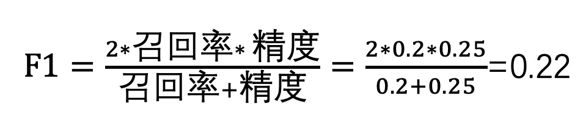

# 3 模型评估

在测试AI系统中的模型训练和评估阶段，需要使用准备好的数据集对AI模型进行训练和评估。在训练过程中，应该对模型进行监控和调整，以确保模型的准确性和效果。在评估过程中，需要使用测试数据集对模型进行测试，以验证模型的准确性和效果。模型的评估也分为离线评估和在线评估，离线评估，也叫线下评估，是基于训练样本进行模型训练，利用得到的模型在测试样本上进行测试，并计算特定的评估指标。在线评估，也叫线上评估，是在实际生产环境中应用新的模型，并对于真实用户类似点击次数、搜索次数等行为进行收集和分析。绝大部分是通过A/B测试实验来完成的，但是针对模型的实验中我们要保证除了模型的不同其他条件要是相同的，从而才能对比不同模型的差异性，本文中如无特殊说明所说的评估都是模型的离线评估。

## 3.1 LLM中常用生成配置参数含义

在Huggingface中第一次使用大模型的时候，常常会看到一些需要调整的参数，这些参数对于模型的输出有着重要的影响，因此也是需要了解的。

在上图中有 4 个配置的参数分别是 Max new tokens、top-k、top-p以及 Temperature。

token相信大家都不陌生了，现在在常用的 chatGPT 使用过程中个就有 token 的概念，这里的参数是 Max new tokens 的设置，是最大的新 token 的数量，是一个上限值。并不是说每次生成的新 token 都是 Max new tokens 的值。

top-k约束了模型的输出是从权重最高的前 k 个结果中随机返回一个，这里权重反映了可能性的高低。top-k 参数会让模型不会总是选择top 1 权重的结果返回，从而提高了返回的多样性，同时也保证了输出的正确性。上图的含义就是在权重前三的单词cake、coconut、durian里面随机找一个输出，如果随机返回的是 cake、coconut 那么应该并不会有什么问题。如果返回apple，虽然这个单词也在前三的权重里，但是它的权重就非常地了，因此相关性也就比较弱，这样返回的结果就会不是很好了。

top-p是一个累计约束，约束了模型输出是从一组权重不超过 p 值中的随机返回一个单词。这其实又有效的避免了前面 top-k 参数的问题。如上图 top-p 等于 0.3，那么模型就只能从cake、coconut 里面输出一个单词，而不会包含 apple 这个权重非常低的相关性低的输出了。

（PS：embedding 是嵌入层，是一个可训练的向量嵌入空间，每个 Token 都会被表示成一个向量，并在该空间中占据一个独特的位置，词汇表中每个Token ID 都对应一个多维向量，这些向量可以学习编码输入序列号中单个 Token 的含义和上下文。嵌入向量空间已经在自然语言处理中使用了一段时间了）
Temperature 是一个缩放因子，主要作用与模型的 softmax 层，影响 token 的概率分布。temperature是可以控制输出的确定性的，temperature越低，输出结果越确定也就是随机性越低；反之temperature越高，输出结果越具有多样性，也就是随机性越高。

如果 temperature 设置一个大于 1 的值，那么权重分布概率就会相对差异小,否则就会差异相对较大。

## 3.2 模型微调

fine-tune就是在LLM常说的微调的英文。在LLM中要训练一个模型是一个费时、费力、费钱的工作，由于模型规模大、参数多在训练过程中会占用大量的时间和计算资源，尤其是一个复杂任务，想要提升模型的能力，就需要通过大量的数据进行训练这都是需要更多的投入的。那么如果有一个现成的模型，和我们要觉得的问题相似，那么我们就可以通过在这个模型的基础之上通过微调达到我们想要的能力。微调就是在一个预训练的大模型上，使用一些特定领域的数据再次进行训练，从而让预训练模型能够适应特定领域、特定任务。在微调过程中，模型的参数会依据新的数据进行调整，从而可以满足特定领域、特定任务的需求。

那么这个微调也有一些不同的方法，其中全面微调（full fine-tuning）就是在微调过程中全部的模型参数都会有所调整。这也就注定了全面微调对于计算资源的投入、数据规模的要求等都需要更多的支持。全面微调因为调整了全部的参数，很容易引起灾难性遗忘(catastrophic forgetting)，灾难性遗忘就是再进行全面的微调以后得到的模型在原始任务上的能力表现非常糟糕，以至于达到了难以接受的下降。

那么参数高效微调（parameter-efficient fine-tuning，简称PEFT）是另外一种微调方法。PEFT在微调过程中只会调整一部分模型参数或者不会修改原来参数而是加上一些新参数，从而降低了对计算投入和数据规模的要求。PEFT 在参数效率、内存效率、训练速度、模型性能和推理成本上都有综合的平衡。PEFT 中分为适配器微调（adapter tuning）、前缀微调（prefix tuning）、提示词微调（prompt tuning）、LoRA（低秩适配）。

适配器微调在Transformer模型中引人了小型神经网络模块 (称为适配器)。通过一个瓶颈架构实现适配器模块，它首先将原始特征向量压缩到较小的维度(然后进行非线性变换)，然后将其恢复到原始维度。适配器模块将被集成到每个Transformer层中，通常使用串行插入的方式，分别在 Transformer层的两个核心部分(即注意力层和前馈层)之后。另外，在Transformer层中也可以使用并行适配器，其将两个适配器模块与注意力层和前馈层并行放置。在微调过程中，适配器模块将根据特定的任务目标进行优化，而原始语言模型的参数将在此过程中保持不变，通过这种方式，我们可以在微调过程中有效地减少可训练参数的数量。
前缀微调在语言模型的每个Transformer 层前添加了一系列前缀，这些前缀是一组可训练的连续向量。这些前缀向量具有任务的特异性，可以视为虚拟的 token 嵌入。由于只有前缀参数会被训练，因此可以实现参数高效的模型优化。

提示词微调，与前缀微调不同，提示微调主要是在输入层中加入可训练的提示向量。基于离散提示方法，它通过包含一组软提示（soft prompts ）token来扩充输入文本，然后将扩充后的输入用于解决特定的下游任务。在实现中，任务特定的提示嵌入与输入文本嵌入相结合，然后输入到语言模型中

LoRA（Low-Rank Adaptation），将权重更新做一个低秩矩阵分解，使用大模型适配下游任务时只需要训练少量的参数即可达到一个很好的效果，在LoRA中，先冻结预训练模型的权重，然后使用Kronecker乘积重参数化的方法，可以在秩和参数数量间找到更好的平衡。

## 3.3 模型的评估方法

在评估过程中，需要使用各种度量方法来评估模型的准确性和效果，例如精度、召回率、F1分数等等。

精度是指模型正确预测的样本数占总样本数的比例，即：

其中，Precision是指精度，True Positive指分类器正确判断为正例的样本数，False Positive指分类器错误判断为正例的样本数。精度越高，说明模型的分类效果越好。

召回率是指模型正确预测的正样本数占所有正样本数的比例，即：

其中，Recall是指召回率，False Negative指分类器错误判断为负例的样本数。召回率越高，说明模型对正样本的覆盖率越高。

F1分数是精度和召回率的调和平均值，即：

F1分数综合了精度和召回率的指标，是一个综合性的评价指标。F1分数越高，说明模型的效果越好。

现在仅仅完成了精度、召回率、F1的介绍还是很难理解如何使用这些指标来评估一个 LLM 的模型。在 NLP 的评估中有两个评估指标，一个是 ROUGE 用来评估摘要生产的质量，一个是BlEU SCORE 用评估模型生成翻译的质量。这两个指标就是如上指标的应用，再详细解释使用方法之前先介绍一个定义，英文句子中每一个单词叫做 unigram，连续两个单词称为 bigram，连续三个单词称为 3-gram，后面以此类推，连续 n 个单词称为 n-gram。
假设有一个阅读摘要的任务，人类阅读完成后给出的结果是“the weather is very sunny",模型升成的摘要是”the weather is fine“。我们计算ROUGE-1 的精度、召回率、F1如下：

ROUGE-1 的三个指标表示了是人工给出的摘要和模型升成摘要的单词的不一致，但是有时候往往某一个单词不一样却表达的是不一个意思，那么我们可以使用 bigram 来计算上面的三个指标，首先将人类总结的摘要和模型升成的摘要进行一些处理：

这样就按照 bigram 对原来的句子进行了划分，然后计算ROUGE-2 下的三个指标。

可以看出ROUGE-2 的指标比 ROUGE-1 的指标相对都变小了，那么句子越长，这个变化越大。如果要计算其他ROUGE数，也是一样的做法，通过 n-gram 计算对应的 ROUGE-n 指标。很显然，n-gram 越大，计算结果也越小，为了避免这种无意义计算可以采用最长共有子句（Logest common subsequence，LCS）。

按照 LCS 计算ROUGE-L的指标数值。

虽然多种 ROUGE指标，但是不通 ROUGE 下的指标是没有可比性的。那么如何选择n-gram 的大小是要靠模型的训练团队来通过不断的实验来决定的。

BLEU SCORE 也是如上指标的一个应用，是n-gram计算精度指标的进行的再计算，要得到BLEU SCORE 需要对一系列的不同大小n-gram的精度指标再进行平均值的求解。

## 3.4 模型的基准测试

在评估一个模型的时候，仅通过ROUGE、BLEU SCORE评价模型还是太单薄了，并不能全面的反馈模型的能力。在相完整评估一个模型的能力的时候，最重要的是提供一套有效的评估基准。大模型的基准测试越来越多，最开始都是面向单项能力，随着多模态的支持，综合能力评价基准越来越多了，现在常见的基准测试有 GLUE、SuperGLUE、HELM、MMLU等等。

### 3.4.1自然语言处理能力的基准测试：GLUE和SuperGLUE
GLUE（General Language Understanding Evaluation，通用语言理解评估）是2018年有纽约大学、华盛顿大学等机构一起创建的自然语言任务的集合。GLUE包含了 9 项任务，分布如下：
- CoLA（The Corpus of Linguistic Acceptability），该任务主要是评价一个句子的语法是否正确，是单句的文本二分类任务，该数据集是纽约大学发布的,语料来自语言理论的书籍和期刊。
- SST（The Stanford Sentiment Treebank），斯坦福大学发布的一个情感分析数据集，主要是来自电影评论做的情感分类，SST 也是单句文本分类任务，其中 SST-2 是二分类、SST-5 是五分类，五分类在分类情感上区分的更加细致。
- MRPC（Microsoft Research Paraphrase Corpus），是微软发布的数据集，语料来自于新闻中的句子，通过程序自动抽取句子然后经过人工标注句子在语义上的等从而判断相似性和释义性，也属于句子对的文本二分类任务。
- STS-B（Semantic Textual Similarity Benchmark），语义文本相似性基准。语料来自新闻标题、视频标题、图形标题以及自然语言推断数据中提取的句子对集合，每对都是经过人类标注相似性评分 0 到 5，本质上是一个回归问题，但依然可以用分类的方法做，因此可以归类为句子对的文本五分类任务。
- QQP（Quora Question Pairs），是问答社区Quora问题对的集合，也是相似性和释义任务。主要是确定一堆问题在语义上是否等效，属于句子对的文本二分类任务。
- MNLI（Multi-Genre Natural Language Inference），纽约大学发布的，是一个文本蕴含的任务，在给定假设语句（前提）下，任务预测前题是判断假设是否成立。前提语句是从数十种不同来源收集的，包括转录的语音、小说和政府报告。该任务属于句子对的文本三分类问题。
- QNLI（Question Natural Language Inference）是从The Stanford Question Answering Dataset（斯坦福问答数据集, SQuAD 1.0）转换而来的，给定一个问句，需要判断给定文本中是否包含该问句的正确答案，属于句子对的文本二分类任务。
- RTE（Recognizing Textual Entailment），自然语言推断然任务，通过整合一系列的年度文本蕴含挑战赛的数据集进行整合合并而来。数据原始从新闻、维基百科中构建而来/RTE只需要判断两个句子是否能够推断或对齐，属于句子对的文本二分类任务。
- WNLI（Winograd Natural Language Inference），自然语言推断任务，数据集来自Winograd Schema Challenge竞赛数据的转换，该竞赛是一项阅读理解任务，其中系统必须读一个带有代词的句子，并从列表中找到代词的指代对象。

图 1 2023 年 8 月份 GLUE 评估结果
随着大模型能力越来越强大，GLUE的九大任务中已经有很多表现出了模型已经超越了人类的基准，但是这并不能说明机器掌握了英语。因此为了避免类似的误导的结果，SuperGLUE 出现了。SuperGLUE 继承了 GLUE 的基础设计，仅保留了 GLUE 九项任务中的两项分别是RTE和WSC（也就是GLUE中的WNLI模式），还引入了五个难度更大的新任务，这些任务的选择标准包括为了实现难度和多样性的最大化。

- CB(CommitmentBank)，一个短文语料库，语料来自华尔街日报、英国国家语料库的小说、switchboard。评估指标采用准确的、F1 分数，其中 F1 分数是每类 F1 分数的不加权的平均数。
- COPA（Choice Of Plausible Alternatives），这是一个因果推到任务，会向系统提供一个前提句子和两个可能的选项。采取准确度作为评估指标
- GAP(Gendered Ambiguous Pronoun Coreference),是一个性别方面平衡的语料，主要是为了测试识别有歧义代词的指代目标的能力。评估指标是 F1、偏见，即在测试样本的男性代词和女性代词子集上的 F1 分数的比值。
- MultiRC（Multi-Sentence Reading Comprehension），是一项真假问答任务。每个样本都包含一个上下文段落、一个有关该段落的问题和一个该问题的可能答案的列表，这些答案必须标注了真或假。评估指标是每个问题的正确答案集的 macro-average F1 分数（F1m）和在所有答案选项上的 binary F1 分数（F1a）。
- WiC(Word-in-Context),针对的是词义消岐任务，该任务被设定成了在句子对上的二元分类问题。采用准确度作为指标。

图 2 2023年 8 月份SuperGLUE的结果

但是 GLUE、SuperGLUE 都是针对英文的语言能力测试，我国的一些研究机构、大学也提出了对应的中文能力的基准测试 CLUE、SuperCLUE,如果需要测试模型中文语言能力可以采购这两个模型。

### 3.4.2 模型的知识获取能力基准测试：MMLU、C-Eval

MMLU（Massive Multitask Laguage Understanding），是一个知识获取能力评价模型，通过零样本、少样本来衡量模型在预训练期间获得的知识，这种方式更贴合于对于人类的评估过程。MMLU提供了57个任务涉及到了初等数学、美国历史、计算机科学、法律、伦理道德等。

图 3 MMLU 测试结果

清华大学和上海交通大学联合发布了中文 MMLU：C-Eval基准测试。C-Eval包含了13948个多项选择题，涵盖了52个不同的学科和四个难度级别，如图 4 所示。

C-Eval 网站接受结果提交，同时也会对一下常用模型进行测试，并给出评估结果排名，如图 5 所示，详情可以去官方网站查看https://cevalbenchmark.com/index.html。

图 5 2023年 8 月 C-Eval 测试结果

### 3.4.3 多指标综合基准测试：HELM
HELM（Holistic Evaluation of Luaguage Model)从名字上就能看出这是一个以全面评估语言模型的基准测试，其包含了七个评估指标，分别是精准度、校验、鲁棒性、公平、偏见、毒性和效率（原味ccuracy, calibration, robustness, fairness, bias, toxicity, and efficiency），提高模型的透明度。HELM力求一个广泛的覆盖，建立一个多评估指标的评估方法，并给出标准化的场景完成全面的评估。

图 6 HELM 的场景和指标映射关系

无论怎么选择，对于模型来说基准测试中的数据对于模型是第一次遇见将会使得结果更加的准确，也能更客观的反馈模型的能力。
 
 ## 3.5 总结
 
随着各式各样的AI系统的出现，模型评估会变得越来越多样化，那么如上介绍的也可能也会退出模型评估的对应基准的选择范围。那么，无论怎么发展这种基准测试都是模型评估的方法都不会过时，这也为各种模型的横向对比提供了一个客观的评价方法，也为模型在某一方面的能表现提供了一个客观的评价基准。