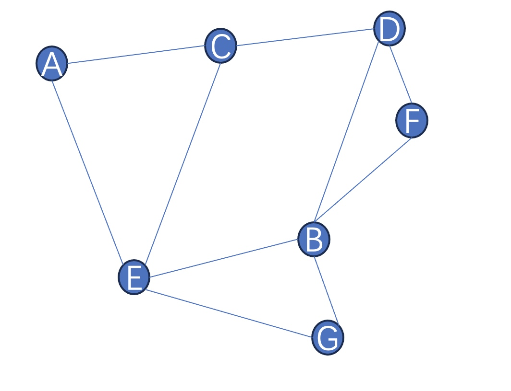

# 4 AI系统的测试关键技术和实践

# 4.1 功能测试的困局

在传统系统的功能测试中，测试工程师无论是做手工测试还是自动化测试，都必须先设计和开发测试用例，然后才能利用测试用例完成测试工作，给出测试结论。从这里可以看出，测试用例是测试工作中很重要的产出物。IEEE 610在1990年就给出了测试用例的定义“为特定目的开发的一套测试输入、执行条件以及期望结果的集合，例如运用特殊的程序路径或检查应用是否满足某个特定的需求。”从这个定义中我们可以看到，测试用例包含了三个条件分别是测试输入、执行条件和期望结果，这三个条件有一个共同的约束词就是一套。这表明这三个条件是一个三元组，相互之间是有关联的。一条测试用例一定包含了一组的输入条件，一系列明确的执行条件和一组明确的期望结果。在测试执行过程中，如果测试工程师必须严格遵从测试用例的输入、执行条件完成和被测试系统的交互，最后将实际结果和预期结果进行比对，判断测试是否通过。这个过程中，测试工程师如果发现系统的实际结果和测试用例中的预期结果不一致，就应该发现了一个问题，如果测试用例设计没问题，那么就发现了一个缺陷，如果测试用例不对，就需要修改测试用例的问题。但是无论怎么样，测试用例执行工作都是检查被测试系统的实际输出和预期结果偏差的工作。在传统的软件测试中，功能测试用例设计方法包含了边界值法、等价类划分法、因果图法、场景法、正交试验法等多种测试用例设计方法，那么每一种其实都是基于软件系统的设计逻辑，这里的设计逻辑其实是代码的实现逻辑，从而设计出一些应该有的输入和对应的输出，这些输入和输出是成对出现的，是站在原始需求的基础之上，依据代码实现逻辑设计的。如上这些测试用例设计方法可以让测试工程师站在代码实现之上“猜测”测试输入和预期输出，这种“猜测”不是胡乱构建的，而是通过一种或者几种科学的构造方法构造的，例如边界值，不那么就是站在程序设计过程中很容易忽略边界数据从而提出的测试输入的构造方法，在构造好输入后，人工再将输入本应该经过开发好的代码后输出的的预期结果设计出来，从而实现测试用例的可指导测试执行过程的目的。

那么如上传统的功能测试的测试思路对于基于AI或者LLM的系统来说并不是完全适用了，由于缺乏关于AI相关系统的测试方法、测试实践的文章或标准文献，我们很难再使用原来的传统软件的测试验证思路来完成测试验证，这些AI相关的系统的输出不是完全标准的输出，他们会随着系统的服务时长改变，相应内容会随着操作和使用的时间的推移而发生变化，这也就是我们常说的”测不准的问题“。传统的测试技术是基于完全软件实现的可预测性而来的，开发工程师按照需求设计业务逻辑，在代码编写过程中通过分支实现了可预测的业务逻辑，那么传统的软件测试技术就是基于如上的基础基于固定的输入验证是否实现了可预测的输出。对于AI相关的系统，那么这种方法就应该不适用了，我们无法让AI相关的系统每一次的输入都100%的准确输出对应的内容，因此我们就需要采用另外的方法来验证AI相关系统的业务需求的质量，这往往是在一系列的辅助指标的帮助下得到的，测试过程中通过一系列的指标的达标水平来判断测试结果的可接受程度。AI的算法是面向范围的准确度的计算而不是面向预期结果的设计，因此在AI相关系统的测试中最好以统计结果方式评价系统，测试工程师需要定义每个结果的置信区间，从而来确认AI测试的结果是否正确，落在置信区间内的就是测试通过，落在置信区间外就是测试

对于AI相关的系统的测试而言，测试工程师并不会有多少机会测试模型或者算法本身上，这并不是说算法、模型没有测试的价值，这往往是因为AI相关的系统的构建方式导致的。这也不能说AI相关的系统测试就只能交给“命运”了，其实还有一些测试方法和实践可以适用于AI系统的测试的。

## 4.2 蜕变测试

AI相关系统的“测不准”的问题是测试准则（Test Oracel）的问题，这种问题其实不仅仅是AI相关系统要面临的问题，测试人员很难构造程序的预期输出，以确定实际执行结果与预期结果是否一致。说白了就是在设计测试用例的时候，很难确定预期结果是什么，那么就很难判断测试用例是不是通过了。在设计传统软件测试用例的时候，我们都是建立在给定输入再经过被测试系统处理后给出的输出可以预先设计，在实际执行过程中对比预先设计的结果和实际执行的结果，这些都是建立在软件的期望输出都是可以已知的前提下。但是在AI相关系统的测试中就很难建立这种已知的期望输出，蜕变测试（Metamorphic Testing）就是解决这类很难建立测试准则的不清的问题而出现的。在2009年的《Metamorphic Testing: A New Approach for Generating Next Test Cases》文章中，蜕变测试首次被提出来，在文中作者认为没有发现错误的测试用例（也就是运行通过的测试用例）同样是有有用的信息在的，可以通过已经测试通过的测试用例构造更多测试用例，而这些测试用例能够和已通过的测试用例建立关系，这样就省去了新测试用例的预期结果，通用可以让这些新的测试用例执行结果有效。蜕变测试通过检查程序的多个执行结果之间的关系来测试程序，不需要构造预期输出，通过识别被测试软件的业务领域和软件实现中的蜕变关系，通过蜕变关系生成新的测试用例，通过验证蜕变关系是否被保持来决定测试是否通过。其中蜕变关系（Metamorphic Relation） 是指多次执行目标程序时，输入与输出之间期望遵循的关系。蜕变测试一般可以分为如下几个步骤来使用：

- 1 利用测试用例设计方法为被测试系统设计测试用例，然后执行这几个生成的测试用例，并顺利执行通过
- 2 针对已经通过的测试用例和被测试系统构造一系列的蜕变关系， 基于蜕变关系设计新的测试用例
- 3 执行新设计的测试用例检查新设计的测试用例是否满足蜕变关系，从而给出测试结论。

假设我们设计了一个计算如下公式的代码：
$$
\begin{align}
  \tag{1}
    y = x^2
\end{align}
$$
假设实现了对应代码如下：

```python
def cal(x:int)->set:
    if x>0:
        return x*x
if __name__ == '__main__':
    print(f"y={cal(2)}")
```


我们可以利用边界值设计测试用例，有一个x=2的时候输出y=4的预期的测试用例，那么通过如上代码我们可以建立一条蜕变关系,x=-2的结果和x=2的结果一致，因此我们讲x=-2输入到对应的程序中，结果是y=None和x=2不一致，那么x=-2没有满足应该有的蜕变关系，所以我们可以证明被测试程序有问题，需要修复该问题。虽然如上是一个小例子，但是我们也不难看出原始的测试用例和蜕变关系是蜕变测试能够起效果的决定因素。在使用蜕变测试过程中，是否建立了原始有效的测试用例，是这个蜕变测试行之有效的关键因素一致，其二就是正确的蜕变关系，有效的蜕变关系是保证蜕变测试的测试结果可信的决定性内容。

图4-1 蜕变测试的示意图

蜕变测试最重要的就是找到蜕变关系，如图4-1中所示，测试用例1种的输入1{I1， I2，…,In}经过AI模型的运算后得到了输出1{O1， O2，…,On}，其中n是大于等于1的正整数。在被测试的AI模型的处理逻辑之上我们找到了蜕变关系MR，那么我们将测试用例1的输入1通过一种参数扰动的处理，得到了输入1‘{I1’， I2’，…,In’}，输入1‘经过AI模型处理后得到的输出1’{O1’， O2’，…,On’}，这时候需要验证输入1与输出1‘是否还是存在蜕变关系，如果是，那么说明新的测试用例是有效的，蜕变测试通过。这里提到了参数扰动（pertuibation）有很多的方法，在NLP测试中比较常用到的方法有同义词、近义词和错误拼写来改变输入；在图像图形的一下可视化计算方面比较常用的有旋转、模糊、加噪音等；在分类算法中，类别的切换是比较差给你哟过你的方法；在数值计算中，本地的数值增加或者减少是比较有效的处理方法。那么对应的蜕变关系就会表现成和原测试用例结果保持不变，增加或者减少，例如在一个分析句子情感的AI算法，我们如果替换了输入部分的一些同义词，那么分析结果就应该不变。再如如果针对某一个人一年工作的绩效综合打分的AI模型，如果测试输入数据从准时上班修改成每天迟到，那么结果的蜕变关系必然是减少绩效考核分数的。

在使用蜕变测试完成测试的时候，最开始设计的测试用例最好采用随机值而非特殊值设计测试用例，在这样的测试用例基础之上通过蜕变关系设计的测试用例对于测试的结果更加有效。蜕变关系对于错误的敏感性主要是由错误的特效以及错误与关系方式决定的。等式形式的关系在错误增加时表现比较好，含有带测试程序的语意信息越丰富的关系其测试效果越好。蜕变测试最初仅仅使用在数值型程序测试，例如三角函数的代码测试，后面蜕变测试逐渐应用到了更广泛的领域，例如无向图中两个点的最短距离，如图4-2中所示，无向图的从点A到点B的最短距离和从点B到点A的最短距离是相等的。



图4-2 无向图

对于AI相关的系统而言，蜕变测试可以用于验证模型对输入的不同变化是否能够产生一致的输出，或者检测模型对于一些已知变形的鲁棒性，这有助于识别模型的局限性和可能的错误。假设你需要测试一个基于深度学习进行图像分类的模型，通过读入照片识别照片中是不是一只猫。

- 初始测试用例：

    - 输入图像：一张包含猫的图像。
    - 预期结果：是一只猫

- 变形规则：
    - 基于此进行一些蜕变关系，然后设计新的测试用例，例如旋转图像、调整图像亮度、翻转图片等等，如图4-3所示。

- 生成变形测试用例：
    - 通过将初始测试用例的图像旋转 90 度，生成变形测试用例。
    
- 运行变形测试用例：
    - 将变形测试用例输入模型，获取模型的输出。

- 检查输出关系：
    - 检查输出，变形规则是否影响了模型的分类结果。在这个例子中，猫仍然应该被正确分类为猫。


图4-3 蜕变测试用例举例

检查输出，变形规则是否影响了模型的分类结果。在这个例子中，猫仍然应该被正确分类为猫。
通过应用这样的Metamorphic Testing，你可以验证模型对于图像旋转等变形是否具有鲁棒性。这不仅有助于确保模型在不同条件下的性能一致性，还能够发现模型的一些潜在问题，如对图像变形的敏感性。

其他可能的变形规则包括缩放图像、添加噪声、改变颜色等。如上是一种分类的AI系统，那么对于目前比较流行的AIGC同样也可以使用蜕变测试来完成测试，假设我们要使用蜕变测试来测试ChatGPT，步骤如下：

- 初始测试用例：
    - 输入：一个简单的数学问题，例如："5乘以8等多少"
    - 预期结果：包含40这个计算结果的通顺的反馈

- 变形规则：
    - 加上一些上下文，例如场景描述、问题的来源、人物对话等内容。

- 生成变形测试用例：
    - 如果你有5箱苹果，每箱有8个苹果，你一共有多少个苹果呢？

- 检查输出关系：
    - 检查ChatGPT的回复是否保持了对原始问题的一致性。在这个例子中，ChatGPT应该仍然能够理解问题的本质，并给出正确的数学答案。如图4-4所示。


图4-4 ChatGPT蜕变测试

在每种情况下，都需要确保原始类别不应受到不必要的变化的影响。蜕变测试可以帮助评估模型对于这些变化的鲁棒性，并提供更全面的测试覆盖。

蜕变测试可以有效解决当前的AI的“测不准”的问题，但是在蜕变关系的寻找、蜕变测试实施上都有很多问题，在学术界基于路径分析技术，制定了三种蜕变测试准则分别是蜕变域全路径覆盖（APC）、蜕变关系全路径覆盖（APCEM）、蜕变关系全路径对覆盖（APPCEM），具体可以在《Effect metamorphic tesintg based on program path analysis》文中学习，但是这的要把这些应用到实践，还需要更多的摸索和实践。

由此可见，蜕变测试也已经经历了很长时间的发展，从学术领域逐渐的走到了工业领域，因为其就是为了解决测试准则的问题而生的，所以就非常适合AI相关的应用的功能测试。如上给出的全部例子都是基于一种有效的测试用例找到了对应的蜕变关系，其实这种蜕变关系也不一定非要从功能正确的测试用例开始的，我们也可以通过一些反向的测试用例找到对应的蜕变关系，从而设计出很多的测试用例，假设我们前面例子中的一个基于深度学习进行图像分类的模型，通过读入照片识别照片中是不是一只猫，那么我们可以输入一下不是猫的图片，然后基于这个蜕变关系，从完成测试。

- 初始测试用例：

    - 输入图像：一张包含熊猫的图像。
    - 预期结果：不是一只猫

- 变形规则：
    - 基于此进行一些蜕变关系，然后设计新的测试用例，例如旋转图像、调整图像亮度、翻转图片等等，如图4-5所示。

- 生成变形测试用例：
    - 通过将初始测试用例的图像旋转 90 度，生成变形测试用例。
    
- 运行变形测试用例：
    - 将变形测试用例输入模型，获取模型的输出。

- 检查输出关系：
    - 检查输出，变形规则是否影响了模型的分类结果。在这个例子中，熊猫仍然应该被正确分类为不是猫。


图 4-5 蜕变测试用例举例

这样同样也是一条有效的蜕变关系产生的蜕变测试用例，那么对于检测对应的系统功能正确性同样有效。


## 4.3 传统软件的测试实践仍然有效

蜕变测试解决了”测不准“的问题，但是一个能够对外提供服务的AI系统并不仅仅都是无法确定TestOrcale的需求，除去和AI直接相关的功能外，还有很多其实是为了让模型更好的提供服务而做的需求开发，例如支持交互的聊天室类的交互页面，为了验证用户身份的登录和鉴权，为了用户更好的使用而设计的历史交互信息保留等等功能都需要测试，这些功能的测试完全可以用我们比较传统的测试用例设计方法完成测试用例设计，采用分层测试模型进行质量交付的保证，通过兼容性测试为不同浏览器、不同网络环境、不同PC端提供流畅并且易用的交互等等。
### 4.3.1 测试用例设计方法同样有效
软件测试用例设计方法已经有很多，每一种都是在不同的实践过程中被发现并且不断地验证后得出来的，例如边界值分析法重点就是测试输入数据的边界值的处理逻辑的，这边界值包含最大值、最小值、临界值等等，通过测试这些边界值在系统的的处理逻辑，可以发现系统对于边界情况的处理是否正确。

图4-6 Claude的登录也没

例如在Claude（Claude 是Anthropic公司开发的基大模型的人工智能聊天机器人）的登录界面（如图4-6所示）测试email的输入框，就可以使用边界值测试用例设计。边界值分析法主要是找到输入的边界条件，然后选取刚好满足的输入和刚好不满足的输入，这个边界就是从软件需求和一些业务规则中得来的。针对Claude的登录页面中的email输入框，Email构成规则都是英文、数字、@符合、英文句号等，其他特殊字符不能出现在email地址中。那么按照如上的规则我们可以如下的思路采用边界值设计测试用例。

- 输入合理的英文及数字字符组成的正确格式
- 格式正确的前提下输入第一部分中的异常字段校验
- 输入无@的格式，如：criss.com
- 输入@前无内容的格式，如@criss.com
- 输入@后无内容的格式，如chan@
- 输入@前后均没有内容的格式，如@
- 输入没有域名的格式，如chan@criss.，chan@criss
- 输入email中有多个@的，如chan@@criss.com，criss@c@chan.d
- 输入@后面直接跟域名的，如chan@.com
- 输入@后面有多个分隔符的，如chan@criss.c.r，chan@criss.c.r.i
- 输入@前面有分隔符的情况，如chan.criss@c.r，chan.criss.c@r.i，chan.criss@c，chan.criss.c@r

除了最容易学习和使用的边界值分析法外，等价类划分法、因果图法、场景法也同样都可以用来设计AI系统的测试用例。下面就已Claude的注册流程利用场景法做一些测试用例的设计。

图4-7 注册Claude过程界面截图

首先输入一个正确可用的邮箱，然后将Claude发送给邮箱的验证码复制到第二步后，点击下一步，然后需要输入一个手机号码，后发送验证码短信，最后输入手机短信验证码并完成验证后就可以使用Claude了。


图4-8 场景法示意图

基本流：就如上一样的进入Claude首页，输入有效的邮箱，然后验证邮箱验证码，在输入有效的移动电话号码，接下来输入有效短信验证码，就完成了注册。
备选流1：有效无效
备选流2：邮箱验证码无效
备选流3：手机号码无效
备选流4：手机验证码无效

按照场景法，设计测试场景如表4-1 所示：

表 4-1 测试场景


针对表4-1的测试场景，设计的测试用例如表4-2所示。
测试用例场景覆盖表
表4-2 测试用例场景覆盖表


根据表4-2设计测试用例如表4-3所示。
表4-3测试用例


如上就是通过场景法设计了Claude注册流程的测试用例，在一些错误上我们其实可以再多设计一些错误类型，例如美国的国际电话区号使用了中国手机号等等，更加的丰富场景。从上面的几个例子，我们可以看出传统软件的测试方法，在AI系统中同样适用。那么其他的测试用例设计方法，就不在举例了，都适用AI系统的测试用例设计。
### 4.3.2 分层测试还会发挥作用
测试分层模型在传统软件测试被普遍认可和使用，那么在AI系统的测试中分层测试也同样适用。AI系统的组成可以分成模型和应用系统，那么模型的测试方法、测试用例设计方法以及模型的覆盖方法在在第二章中已经有了详细的介绍，那么对于应用系统部分其实就是传统软件，那么单元测试、接口自动化测试、UI自动化测试每个分层中的实践都需要实施“越早开始测试，发现问题修复问题的成本越低”，这句话决定了在单元测试阶段发现的问题修复成本最低，因此应该加大单元测试的投入，因此在金字塔模型中单元测试就应该占据的面积最大，以此类推，接口测试次之，界面测试占面积最少。也就是说，在金字塔模型（金字塔分层模型如图4-9所示）中各类测试所占的面积代表了对应测试的投入成本。


图4-9 金字塔分层模型

其中，单元测试是针对每一个开发交付的函数进行的测试，在单元测试阶段希望执行速度要快、覆盖代码要完整、测试结果要可信。在进行单元测试用例开发的时候，对于被测试函数的数据库操作、缓存操作、外部接口调用、其他函数调用都推荐用解耦工具完成解耦，这样能保证每一个单元测试都能够尽最大范围的覆盖更多的开发代码，保证了测试结果的正确，同时也提高了单元测试的运行速度。
接口测试的被测试对象是SUT（被测试系统，System Under Test）提供的可访问接口，这些接口都应该通过接口测试进行覆盖，那么在接口测试中又分为两中接口测试实施策略，其一是单独的每个接口，针对单独的接口测试更加推荐的事从参数的多样性上对接口的正确性、容错性等做充分的验证；其二是多个接口组合使用后的业务逻辑实现，在针对多个接口实现业务逻辑的接口测试用例开发过程中，对于测试数据的设计应该更加关注业务的一致性，数据库、缓存、消息中间件等中数据的正确性等。UI自动化测试主要是站在最终用户的角度完成自动化验收测试的环节。验收测试是测试部分的最后阶段，利用UI自动化完成最后的验收环境反馈周期提升验收测试的效率。
### 4.3.3 兼容性测试设计方法更加重要

无论AI系统是通过移动端的Native的App进行访问，还是通过Web浏览器进行访问，那么都需要进行兼容性测试，兼容性测试的测试方案的设计同样可以采用传统软件的兼容性测试设计方法。兼容性测试就是针对兼容性做的验证，那么在IOS-IEC 25010中定义的兼容性是指被测试系统同时共享相同的硬件或软件环境时，系统或组件可以与其它产品交换信息、系统或组件，和/或执行其所需的功能的程度。这里面既包含了在与其他产品共享一个环境和资源时，没有任何其他产品的不利影响情况下，产品可以有效地执行其所需功能的程度的共存性；也包含了两个或两个以上的系统、产品或部件可以交换信息，并使用已经交换的信息的程度的互操作性。兼容性测试也就是针对SUT（System Under Testing,被测试系统)的软件质量特性的兼容性进行的测试活动，主要是验证被测试系统是否可与其他软、硬件配合下正确地运作。客户端的种类繁多导致了兼容性测试也并不能随意选择验证就可以保证兼容性的要求。例如移动应用要在不同的硬件移动端设备、不同操作系统、不同网络状况等条件组合下的测试，再比如网页端系统对不同操作系统、不同浏览器、不同硬件分辨率等组合下的测试。任何一个软件系统的运行都是需要一些硬件和软件的配合的，硬件包含了CPU、硬盘、内存、网卡等等设备，软件包含了操作系统、数据库、中间件等一些基础服务，那么在这么多不同的条件之下，通过兼容性测试保障SUT都能够正确的运行，顺畅的交互，就是兼容性测试的目的。在这么多条件下如何设计一种覆盖全面、测试场景组合少就变成了兼容性测试必须解决的问题。通过引入正交试验设计方法，通过计算正交表，实现两两正交设计条件组合，既保证了测试的完整性又保证了测试工作是一个可完成的场景数量。
在设计兼容性测试方案前需要先收集兼容因素，兼容性测试的兼容因素就是SUT系统需要支持的终端类型，这里如果是一个Web的PC服务，就需要知道哪些浏览器以及对应的版本，支持的操作系统等，如果被测系统是一个移动端的服务，那么终端支持的操作系统、终端设备品牌和型号等，这些也并不是测试工程师猜测出来的，也是有一些科学的收集方法。
- 1、	客户的需求：任何一个系统，无论是PC端的还是移动端的，要支持的设备的需求都是从最终用户那里来的。那么兼容因素的一个来源就是需求，这个需要产品经理在和业务方收集需求的时候可以一起收集，但是这也是兼容测试因素的收集条件之一，虽然看似最合理，但是往往却很难拿到一个准确的答复。
- 2、	埋点日志：很多已经上线的系统都有些前端埋点，可以从埋点日志中获取所有访问我们服务的终端信息，从而可以整理出一个访问我们系统的终端的类型，通过它获取我们当前的兼容性测试因素来源之一，如果获取的种类特别多，在实践过程中往往会获取95%的终端类型，这样就近似获取了2个西格玛的兼容指标。当然，如果一个系统是一个全新的系统，这一个获取方式就不起作用了。
- 3、	其他服务：如果一个全新的系统，我们完全不知道怎么处理，那么浏览器可以通过https://gs.statcounter.com/ 获取当前占有量，从而来指导我们设计兼容测试因素。移动端可以通过搜索类似服务来为我们的兼容性测试因素提供一些支持。


完成兼容性因素收集后，就可以进行正交实验的设计方法设计测试用例了，下面以一个Web系统兼容性测试设计的例子讲解一下基于正交试验兼容性测试的实践过程，被测试系统是一个Web系统，可以通过不同的客户需求的终端调用，针对客户实际设备的调研收集，以及和客户在未来设备升级的规划的访谈后，收集完兼容因素，通过表格完成因素的整理，如表4-4 所示。

表 4-4 兼容因素收集表


如上兼容因素表格中可以得出因素数是3，其中浏览器因素的水平数是8，操作系统因素的水平数是2，分辨率因素的水平数是3。依据上面的兼容性测试因素，结合正交实验测试用例设计方法，选择按照因素水平，我们选择强度为2的正交计算后得到的如下正交实验的结果如下4-5表（正交计算既可以按照数学规律手动构建，也可以通过一些开源的正交表构造工具完成），
表4-5 计算得到的正交表


将表格4-4中的对应水平替换掉表格4-5中的序号，就得到了如下表4-6中的兼容矩阵就可到了最终的兼容矩阵。
表4-6 兼容矩阵


如上每一行就是一个兼容场景，这就完成了兼容性测试的设计工作。

### 4.3.4 性能测试仍旧有效
AI系统同样也是需要通过网络对外提供服务的，那么AI系统的性能也是至关重要的一点，在第三章我们介绍的精度、召回率、F1等等都是评价模型性能的指标，那么除去模型之外的软件部分的性能还是需要传统软件的性能测试实践支持的，当然如果要对类似ChatGPT这样的AI系统，在做性能测试的时候应该对模型调取部分做解耦，这是因为模型的性能并不是类似传统系统一样通过并发量来评估的，如果不做解耦会对影响测试结果。在性能测试中我们需要关心如下的一些指标：

- 并发用户数：并发用户数是针对服务端而言，是指在同一时刻与服务端进行交互的在线用户数量。在压力测试期间是并发用户数主要是指同时执行一个或者一系列操作的用户，或者是同时执行脚本的用户，这个并发在设置不同场景的时候并发的情况是不一样的，在实际的测试中需要根据具体的需求进行设计。
- 最大并发用户数：最大并发用户数是指被测服务端所能承载的最多的并发用户，是系统的一个处于过载边界的描述值。主要是描述系统能够提供的最大服务能力。
- 吞吐量：是指单位时间内系统能够处理的请求数量。常用单位时间内系统处理的用户请求数来衡量。对于交互式系统，单位时间是字节数/s、页面数/s或请求数/s，对于非交互系统，单位通常是笔（交易）/s。
- 响应时间：响应时间分为用户响应时间和系统响应时间。用户响应时间是指单个用户所感受到的系统对其交互式操作的响应时间。用户的眼睛存在视觉暂停现象，只能在察觉0.1s以上的视觉变化，用户响应时间在此范围内就可以了。系统响应时间是计算机对用户的输入或请求作出反应的时间。压力测试一般都是站在用户角度考虑问题，因此是用户响应时间。
- 资源利用率：描述信息系统性能能力的一系列数据指标，通常是被测服务器的CPU利用率、内存利用率、磁盘IO、网络吞吐量等。
- 思考时间：信息系统使用者在进行业务操作的时候，发出每个请求之间的时间间隔。

通过性能测试可以评估最终系统在大压力访问的情况的的系统表现。性能测试一般都是通过模拟对系统的并发访问来实现测试和评估的，因此需要对测试环境、初始并发量的规划和计算都有一些经验，由于被测系统的业务逻辑负责度不一样，因此没有一个统一的标准，对于测试环境和并发量都是一些经验实践的总结。在性能测试环境上，对于被测系统的部署环境一般有如下几点建议：
- 被测系统的应用服务器和数据持久化服务器最好分开部署，除非生产环境就是在一台服务器上，否则不能部署在一台服务器上。
- 测试压力机和被测系统服务器要部署在同一个子网下，并且要求之间的访问带宽千兆
- 被测系统第一次测试压力部署一个最小集合。（例如系统有一个APP服务、一个MySQL服务就可以满足被测系统的完整性，那么就先部署一个APP服务、一个MySQL服务）

在性能测试的并发量的评估上，相信很多人每次都会困惑，并发量到底是多少永远都是一个难以确定的值，产品经理、开发工程师、业务人员和测试工程师坐在一起都很难一下就确定这个值是多少，那么下面介绍一些行业内的通用的计算方法，但是这些方法也不是绝对的方法，这些仅仅是压力测试并发用户数的一种计算方法，但是最后是不是测试后的并发量就可以支持实际业务访问数量级别的用户也是由被测系统逻辑复杂的决定的，但是可以用如下的一种方法确定初始开发压力测试的并发用户数。

- 1）计算方法1：首先计算平均并发用户数，采用公司C = nL/T完成计算，根据C计算并发用户数峰值 
$$
\begin{align}
  \tag{1}
    C’ = C+\sqrt[3](C)=nL/T +\sqrt[3](nL/T)
\end{align}
$$

其中C是平均并发用户数，n是login session的数量，L是login session的平均长度，T是值考察的时间长度，C’是并发用户数峰值。举个例子 某公司为其170000名员工设计了一个薪酬系统，员工可进入该系统查询自己的薪酬信息，但并不是每个人都会用这个系统，假设只有50%的人会定期用该系统，这些人里面有70%是在每个月的最后一周使用一次该系统，且平均使用系统时间为5分钟。则一个月最后一周的平均并发用户数为（朝九晚五）
$$
\begin{align}
  \tag{2}
    C’ = nL/T +\sqrt[3](nL/T)=170000*0.5*0.7/5+\sqrt[3]170000*0.5*0.7/5=129
\end{align}
$$

$$
\begin{align}
  \tag{3}
    C = nL/T=170000*0.5*0.7/5=124
\end{align}
$$

- 2）计算方法2：对绝大多数场景，我们用（用户总量/统计时间）影响因子（一般为3）来进行估算并发量。 比如，以乘坐地铁为例子，每天乘坐人数为5万人次，每天早高峰是7到9点，晚高峰是6到7点，根据8/2原则，80%的乘客会在高峰期间乘坐地铁，则每秒到达地铁检票口的人数为5000080%/（36060）=3.7，约4人/S，考虑到安检，入口关闭等因素，实际堆积在检票口的人数肯定比这个要大，假定每个人需要3秒才能进站，那实际并发应为4人/s*3s=12，当然影响因子可以根据实际情况增大。因此C=12。
- 3）计算方法3：比如一个网站，每天的PV大概1000w，根据2/8原则，我们可以认为这1000w pv的80%是在一天的9个小时内完成的（人的精力有限），那么TPS为：1000w80%/(93600)=246.92个/s,取经验因子3，则并发量应为C=246.92*3=740
- 4）计算方法4：系统最大在线用户数的8%到12%，C=系统最大在线用户数的8%到12%。
- 5）计算方法5：C=(Think time + 1)*TPS，Think Time是思考时间，TPS是每秒事务数。

如上的并发量评估方法都是经验方法，没有任何一个方法可以准确评估除并发量，只能作为性能测试并发量的初始值开始，不断地在测试过程中依据性能测试的资源数据做调整，最终找到测试的最优解。在完成测试环境的搭建、测试并发量的评估后，就可以选择一个熟悉的性能测试工具开始做性能测试了。

## 4.4 ChatGPT类的应用中SSE协议的接口测试

### 4.4.1 SSE协议的接口测试
> SSE是server-sent events协议简称，SSE协议主要是依托于HTTP链接用来从服务端将消息、信息、事件推动给客户端的协议。

### 4.4.2 SSE简介
SSE最近突然的被很多人关注还有一个主要原因就是ChatGPT等大模型的聊天类系统就采用了SSE协议。在使用ChatGPT的时候，输入Prompt后的反馈是逐渐的显示在聊天区域的，这部分的实现就是主要基于EventStream的事件流，类似打字机一样输出的，这就是SSE的实现，其实类似一下股票行情推送、期货行情推送都可以使用SSE实现。

SSE采用了long-polling的机制，Client端发送了一个HTTP的请求到Server端，Server端就保持了这个HTTP的链接并周期性的发送消息给Client端。SSE主要解决了Server端不断向Client端发送实时数据的场景需求，因为SSE是基于HTTP协议的所以对于浏览器兼容性非常好。在解决实时传输场景的技术方案中，WebSocket是目前更加广泛的解决方案，虽然SSE和WebSocket都是为了实现实时性传输、低延时通信而出现的协议，但是它们一些区别：
- SSE是基于HTTP协议的长连接，客户端发起请求后会保持连接不断直到服务器主动关闭或者网络通信故障导致断开为止，在连接之上也只是Server端发送数据给Client端的单向通信，在大量高频小数据传输或即时交互的应用中并没有WebSocket高效。
- SSE是基于HTTP协议的，每次传输都是需要消耗一定的带宽，而WebSocket是二进制传输协议，对于带宽消耗就很小。
- 最大的区别就是SSE是单向通信的（如图4-11），WebSocket是双向通信的（如图4-10）。所以SSE比较适合解决一些推送类的场景例如股票行情、IoT等，WebSocket就更加适合聊天室、实时协作应用等。

图4-10 WebSocket协议通信示意图

SSE协议开始也是从客户端发送请求开始的，客户端发送一个Get请求到服务端，其中HTTP部分头如下：
```
GET /api/v1/live-scores 
Accept: text/event-stream
Cache-Control: no-cache
Connection: keep-alive
```
Accept为text/event-stream就是Client端要和Server端说明它期望获得一个event stream，Connection设置成keep-alive表示这个是一个”长连接“请求。后续服务端就在这个保持的链接上不断地给Client端推动Event，传输的示意图如4-11。


图4-11 SSE协议的通信示意图

原理就讲完了，如果作为一名测试工程师，面对一个SSE协议的接口服务，应该在怎么完成这个接口测试呢？下面就回详细的说一下。

### 4.4.3 SSE 服务端代码

首先我们需要一个被测试系统，能够支持SSE协议的传输，源代码如下：
```
import json
import time

from flask import Flask, request
from flask import Response
from flask import render_template

app = Flask(__name__)


def get_message():
    """this could be any function that blocks until data is ready"""
    time.sleep(1)
    s = time.ctime(time.time())
    return json.dumps(['当前时间：' + s , 'sse server'], ensure_ascii=False)


@app.route('/')
def hello_world():
    return render_template('index.html')


@app.route('/stream')
def stream():
    user_id = request.args.get('user_id')
    print(user_id)
    def eventStream():
        id = 0
        while True:
            id +=1
            # wait for source data to be available, then push it

            yield 'id: {}\nevent: add\ndata: {}\n\n'.format(id,get_message())


    return Response(eventStream(), mimetype="text/event-stream")


if __name__ == '__main__':
    app.run()
```

如上代码是基于flask框架的Web服务Demo，实现了一个简单的SSE协议的接口。访问`http://127.0.0.1:5000/stream`就得建立的SSE链接，并且Server端不断地给客户端推动当前系统时间。


### 4.4.4 SSE客户端

单纯运行了如上SSE的Server还并不能很好的体验SSE协议的奇妙，也就无法理解为什么类似ChatGPT会选择这个协议来完成LLM反馈的传输。我们现在写一个客户端程序，可以正确接受上面SSE的Server发送给Client端的Event。

```
import json
import pprint
import sseclient
import requests

def event_handler(message):
    '''
    @des  ：打印接收到的数据
    @params  :message世界收到的event
    '''
    pprint.pprint(f"Data: {message.data}")
def with_requests(url, headers):
    '''
    @des  :访问sse的服务器，建立链接
    @params  :url 服务器地址和端口，还有路由拼凑的地址，
    @params  :headers SSE是在http基础之上建立的链接，因此需要设置请求头Accept为text/event-stream
    @return  :response 建立的链接
    '''
    
    
    return requests.get(url, stream=True, headers=headers)
def test_sse_api(api_url):
    '''
    @des  : 访问sse的服务器，建立链接，然后开始接收数据
    @params  :api_url SSE是在http基础之上建立的链接
    '''
    headers = {'Accept': 'text/event-stream'}
    response = with_requests(api_url, headers)  

    #检查请求返回是否成功 
    if response.status_code == 200:
        # 如果成功，创建一个SSEClient对象
        client = sseclient.SSEClient(response)

        try:
            # 开始监听SSE的流
            for event in client.events():
                event_handler(event)
        except KeyboardInterrupt:
            print("Stopping SSE stream.")
    else:
        print(f"Failed to connect. Status code: {response.status_code}")

if __name__ == "__main__":
    api_url = 'http://localhost:5000/stream'
    
    test_sse_api(api_url)


```

先运行Server端，在运行上面Client端代码，你可以在IDE的控制太不断地看到刷新点额服务器端传输回来的时间，这就是在SSE协议的好处，Server端不断地推送数据给Client端，Clinet端仅仅发起了一次请求就可以不断地接受Server端返回的数据。

### 4.4.5 SSE接口的测试脚本
那么如果有一个SSE接口，接口自动化就可以在如上Client端的代码基础之上，引入pytest类的测试框架，完成测试脚本的开发了，如上的接口测试代码如下：
```
import pytest
import sseclient
import requests

@pytest.fixture
def with_requests(url='http://localhost:5000/stream', headers= {'Accept': 'text/event-stream'}):
     return requests.get(url, stream=True, headers=headers)
    
def test_test(with_requests):
   
    response = with_requests 
    if response.status_code == 200:
 
        data=""
        for event in client.events():
       
            data=event.data
            break
        assert "sse" in data
    else:
        print(f"Failed to connect. Status code: {response.status_code}")

if __name__ == '__main__':
    pytest.main()
```

## 4.5 总结

AI系统的出现对于软件测试也提出了新的挑战，”测不准“的问题一致困扰着对于AI系统的测试过程，蜕变测试就是为了解决这种Test Oracle不确定的问题出现的，也就天生就是解决了AI系统的测不准的问题。但是在AI系统中除去和AI强相关的部分功能外，其他的部分的软件质量同样还是可以使用传统软件测试的实践的，例如软件测试用例设计方法、兼容性测试实践、分层测试模型以及性能测试设计经验等等。在面对AI系统的测试的时候，既要充分利用我们传统的测试实践也要通过不断地思考解决一些现有测试方法、实践难以完成的检验和评估的问题上。